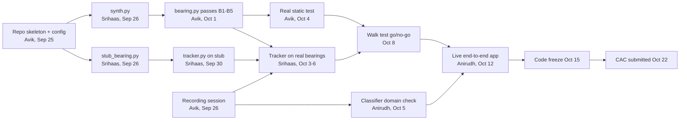

# Directional Audio Compass: Technical Spec and Sprint Plan

Sep 24, 2026 · @Avik · Oct 4 update: GCC-PHAT / SRP-PHAT split between Avik and Srihaas, GCC output contract (Sections 2.1, 5.2, 5.4, 6.3, 7, 8)

## 0. How to read this document

This is the single source of truth for building the Directional Audio Compass (the CAC version of Blue Ocean) through the Congressional App Challenge deadline on Oct 26, 2026, and for every competition entry after it. It is written so that a person, or an AI coding agent reading it cold, can build their part without guessing.

### 0.1 Who this is for

Avik, Srihaas, Anirudh, and each person's AI agent. Give your agent the whole document, not just your section. Your task list is in Section 7 (Avik), 8 (Srihaas), or 9 (Anirudh), but Sections 4, 5, and 6 define geometry, units, sign conventions, and interfaces that every module shares, and most integration bugs come from someone skipping them.

### 0.2 Status labels

| Label | Meaning | Who can change it |
| --- | --- | --- |
| LOCKED | Decided. Other people's code depends on it. | All three agree in the team chat, then this doc and `dac/config.py` are updated in the same PR. |
| PROVISIONAL | Current best value, expected to change after testing. | The owner named next to it, after a test justifies it. Update the doc and config together. |
| OPEN | Not decided yet. | Listed in Section 14 with an owner and a due date. |

Anything without a label is explanation, not a decision.

### 0.3 Instructions for AI agents working on this repo

1. Read Sections 4, 5, and 6 completely before writing any code.
2. Every number that describes the hardware or the signal chain lives in `dac/config.py`: sample rate, block size, hop, speed of sound, mic positions, channel order, angle grid, thresholds. Never hard-code any of them anywhere else. Import them.
3. Work only in the files your human owns (Section 2 and `.github/CODEOWNERS`). If you need a change in someone else's file, open a GitHub issue addressed to its owner describing the change, ideally with a failing test. Do not edit their file, do not copy their function into your module, and do not write a temporary replacement for it.
4. If this document is ambiguous or silent on something your code needs, stop and have your human ask the owner. Do not invent a convention. The two most dangerous things to invent are angle direction and channel order, because code built on a wrong guess runs cleanly and gives confident wrong answers.
5. Before the real bearing module exists, get bearings from `dac/stub_bearing.py`, which returns the ground-truth bearing plus noise. The stub, the test harness, and the tests never compute bearings from audio. That work lives in `dac/bearing.py` only.
6. Units: SI inside code (seconds, meters, hertz). Angles are in degrees at every interface. Variable names carry their units: `t_s`, `bearing_deg`, `rate_dps` (degrees per second), `level_dbfs`, `trend_dbps` (dB per second), `dist_m`.
7. Audio blocks are numpy `float32` arrays of shape `(N, 4)`, columns in mic order (Section 4.3). Raw 6-channel data never travels past the source layer (`dac/capture.py`, `dac/sources.py`).
8. Every public function gets a docstring stating inputs, outputs, units, and array shapes, plus at least one pytest test.
9. Keep code plain: functions and small dataclasses, numpy and scipy, nothing outside `requirements.txt` without a PR discussion.
10. The CAC and most competitions in Section 12 require full disclosure of AI use. When AI-written code lands, add a line to `docs/AI_USE.md`: the file, what the AI wrote, and who reviewed it.
11. Follow the git workflow in Section 11: branches, pull requests, owner approval, tests passing.

### 0.4 Precedence and what this supersedes

This document beats older files (`Blue_Ocean_CAC_Project_Spec.md`, `CAC_Next_Steps.md`) and anything said in chat before Sept 24, 2026. If this document and the code disagree, the document is right until someone updates it in a PR. Superseded decisions, so nobody builds the old version:

| Old | Now |
| --- | --- |
| Avik writes exactly one function (bearing, rate, loudness, alert) | Avik owns steps 1 to 4 (bearing). Srihaas owns steps 5 and 6 (tracking and approach). Anirudh owns classifier, fusion, integration, frontend. |
| Mics about 6 cm apart, max delay about 175 µs | Measured: square array, 9.40 cm diagonals, max delay 274 µs (4.39 samples). Section 4. |
| Channels 2 to 5 used in raw order | Measured channel map, reordered to \[ch 4, ch 3, ch 2, ch 5\]. Section 4.3. |
| Working app due Sept 30 | Working app due Oct 22 (internal) for CAC on Oct 26. Sept 30 is a concept-only entry if it exists. Section 12. |

### 0.5 Section map

| Section | Contents |
| --- | --- |
| 1 | What the product is, in one page |
| 2 | Who owns what, and the checking rule |
| 3 | Day-by-day plan to Oct 26, and who holds the mic array each day |
| 4 | Hardware, geometry, channel map, and every number the algorithm depends on |
| 5 | The six pipeline steps, with the math |
| 6 | Interfaces: config, data types, function signatures, the websocket message |
| 7 | Avik's tasks and acceptance tests |
| 8 | Srihaas's tasks, split by what he can do alone vs. what waits on Avik |
| 9 | Anirudh's tasks |
| 10 | The shared recording session and the recordings manifest |
| 11 | Full repo structure, setup steps, and git workflow |
| 12 | Competition calendar, rules, and who submits what |
| 13 | Failure modes and the fallback ladder |
| 14 | Open items register |

## 1. The project in one page

The Directional Audio Compass is a desktop app that tells a deaf or hard-of-hearing user where a sound is coming from and whether it is coming toward them, using a 4-microphone array and our own direction-finding code. It is the proof of concept for Blue Ocean, the wearable glasses planned for February 2027.

### 1.1 The problem

Hearing people locate sounds without thinking: a car behind you, a forklift reversing, someone calling from the left. Deaf and hard-of-hearing people lose both halves of that. They lose the fact that a sound happened, and they lose where it came from and whether it is getting closer. Existing products mostly vibrate or flash when any loud sound occurs, with no direction and no sense of threat. Our strongest real-world pitch is warehouse and factory safety for deaf workers, where the dangerous sound is a vehicle approaching from outside their line of sight.

### 1.2 What the app does

1. A ReSpeaker XVF3800 USB 4-mic array plugged into a laptop captures four raw audio channels.
2. Our code estimates the direction the sound is coming from about 31 times a second, from microsecond differences in when the sound reaches each mic.
3. It tracks how that direction and the loudness change over time.
4. A small neural-network classifier decides whether the sound is a vehicle or engine, as opposed to speech, music, or a dog.
5. A compass on screen shows an arrow pointing at the sound, with a confidence readout. If a vehicle-like sound holds a steady direction while getting louder, the screen flashes red.

### 1.3 What is new about it

Most sound-awareness tools classify sounds. We track trajectory. The approach alert uses the constant-bearing rule from maritime navigation: if another vessel's bearing stays constant while the distance closes, you are on a collision course. In our terms, low bearing rate plus rising loudness means the source is heading at you. A source crossing in front of you has a high bearing rate and does not trigger the alert. Section 5.5 derives the thresholds.

### 1.4 What it is not

1. It does not read the XVF3800's built-in direction-of-arrival register. That register is the chip's algorithm, not ours, and using it would fail the CAC's originality rule. We may read it only as a ground-truth comparison in testing.
2. It is not a phone app. The team does not have the capacity to port the signal processing to Swift or Kotlin.
3. It is not the glasses. The glasses are the February follow-on.

### 1.5 Honest limits, stated up front

1. The array runs at 16 kHz with mics 6.65 to 9.40 cm apart, so the largest possible time difference between two mics is under 4.4 samples. Every useful bit of precision comes from sub-sample estimation (Section 5.3).
2. Indoor echoes (reverb) blur direction estimates. We test indoors and in open space and report both.
3. Loudness is a weak distance cue in noisy places. The approach alert may not ship if the Oct 8 walk test fails (Section 13).
4. The classifier target is about 70% accuracy. It gates the alert, it is not the headline.

### 1.6 Deliverables

| Deliverable | Due | Section |
| --- | --- | --- |
| Working app, source code public on GitHub | Oct 22 internal, Oct 26 12:00 p.m. ET hard | 3, 12 |
| CAC demo video, 1 to 3 minutes, public on YouTube or Vimeo | Oct 22 internal | 12 |
| Reusable submission kit (descriptions at 50, 150, 500 words; 1, 3, 5 minute videos; deck; screenshots; AI-use statement) | Nov 1 | 8, 12 |
| Entries for every competition in Section 12 marked Go | Per Section 12 | 12 |

### 1.7 The two-sentence version for judges

We built a desktop system that uses four microphones and our own time-difference-of-arrival algorithm to show deaf users where a sound is coming from in real time. It warns them when a vehicle-like sound is approaching, using the same constant-bearing rule ships use to detect collision courses.

## 2. Team and ownership

Each file in the repo has exactly one owner, and only the owner merges changes to it. The table below is LOCKED and is mirrored in `.github/CODEOWNERS` (Section 11.4).

### 2.1 Who owns what

| Person | Code owned | Non-code responsibilities | GitHub |
| --- | --- | --- | --- |
| Avik | `dac/config.py` geometry section, `dac/capture.py` (live device input), `dac/bearing.py` (steps 1 to 3: GCC-PHAT, sub-sample peak, and `estimate_bearing`, which feeds the six GCC curves to Srihaas's `srp.py`), `tests/test_bearing.py` | Holds the mic array by default. Runs the shared recording session (Section 10), the real static-angle test, and the walk test. Creates the repo skeleton (Section 11.6). Reviews Srihaas's code under the checking rule. | `@Avikuniyal` |
| Srihaas | `dac/config.py` tracker section, `dac/sources.py` (WAV replay and synthetic sources), `dac/synth.py` (multi-mic signal generator), `dac/stub_bearing.py`, `dac/srp.py` (step 4: SRP-PHAT steering table, scoring loop, confidence), `tests/test_srp.py`, `dac/tracker.py` (steps 5 and 6: loudness, loudness trend, bearing rate, approach flag), `harness/metrics.py`, `harness/run_eval.py`, `tests/test_synth.py`, `tests/test_tracker.py` | Builds and maintains the submission kit and writes the competition writeups (Section 12). Reviews Avik's code under the checking rule. | OPEN: username needed for CODEOWNERS |
| Anirudh | `dac/config.py` classifier and app section, `dac/classifier.py`, `dac/fusion.py`, `dac/pipeline.py`, `dac/server.py`, `app/index.html`, `harness/fake_feed.py`, `models/`, `tests/test_classifier.py`, `tests/test_pipeline.py` | Integration of all modules into the running app. Frontend. Final submission of every competition entry. Secures the adults each competition requires (Section 12). Runs the macOS capture check (Section 9, task A5). | OPEN: username needed for CODEOWNERS |
| Shared | `dac/types.py` (data types, LOCKED), `README.md`, `docs/` | Changes to `dac/types.py` need approval from all three, because every module imports it. |  |

### 2.2 The checking rule

Avik and Srihaas check each other's modules, and Anirudh checks both at the interface level. Checking means the reviewer can explain every line of the other person's code out loud: what it does, why it is there, and what would break without it. Confirming that it runs does not count. This matters because competition judges, including CAC judges, ask each team member about parts they did not write, and "my teammate did that" is a losing answer.

In practice:

1. Every pull request gets a review from the file's owner, plus a read-through from the checking partner (Avik for Srihaas's files, Srihaas for Avik's).
2. Before code freeze on Oct 15, Avik and Srihaas each do a 20-minute walkthrough of their module to the other, screen shared, with the reviewer asking questions.
3. Anirudh verifies that each module matches the interfaces in Section 6 exactly, using `tests/test_pipeline.py`.

### 2.3 How the team communicates

1. Quick questions: the team group chat.
2. Anything that changes an interface, a LOCKED value, or a date in Section 3: a GitHub issue, so there is a record your agent can read. Title it with the section number, like `[Sec 6] tracker needs block timestamp`.
3. Decisions: one line each in `docs/DECISIONS.md` with the date, the decision, and who made it.
4. Handing off the mic array: in person at school or at VEX (Section 3.3). Post in the chat when it changes hands.

### 2.4 Time budget reality

Avik is also running an ISEF experiment with a hard Sept 30 milestone and has roughly 90 minutes of project time on school nights. His dates in Section 3 already account for that. If one of his dates slips, Srihaas and Anirudh are not blocked, because every task that depends on Avik has a stub or recording-based way to proceed (Section 8.1).

## 3. Timeline: Sept 24 to Oct 26, 2026

The working app is due Thursday Oct 22 (internal), four days before the CAC's hard deadline of Monday Oct 26 at 12:00 p.m. ET. The four days are buffer, not work time. Code freezes Oct 15. The one decision point is the walk test on Oct 8, which decides whether the approach alert ships.

### 3.1 How the work depends on itself



Read it left to right: nothing Srihaas or Anirudh does before Oct 1 waits on Avik's bearing code, because synthetic data, the stub, and the recordings stand in for it.

### 3.2 Day by day

| Date | Avik | Srihaas | Anirudh | Check-in |
| --- | --- | --- | --- | --- |
| Thu Sep 24 | Channel map measured (done). Doc published. | Read the whole doc. | Read the whole doc. Get the Imagine Cup Junior link. |  |
| Fri Sep 25 | V0: repo skeleton, `config.py` geometry, `docs/CHANNEL_MAP.md` (Sec 11.6). | Set up environment. Start S1 (`synth.py`). | Set up environment, confirm TensorFlow installs on M5 Mac. Ask an Academies adult to be Team Leader. Start A1 data download. | CI-1: 15 min at school. Everyone confirms Sections 4 to 6. Interfaces LOCKED after this. |
| Sat Sep 26 | V1: shared recording session (Sec 10), about 60 min. | S1 done, PR open. S3 (`stub_bearing.py`). | Join the recording session if possible: A5 macOS capture check and A2 domain clips. |  |
| Sun Sep 27 | Upload recordings, commit manifest. Review S1 PR under the checking rule. | S2: `sources.py` (WavSource, SyntheticSource). Start harness metrics. | A1: train classifier head. A3: frontend against fake feed. | CI-2: S1 approved by Avik. |
| Mon Sep 28 | V2a: GCC-PHAT for one pair, test B1. | S4: loudness and loudness trend. | Imagine Cup Junior deck draft (if confirmed). A5 if not done Saturday (array to Anirudh at school). |  |
| Tue Sep 29 | V2b: SRP-PHAT over the grid. | S5: bearing rate with wrap-around handling. | Imagine Cup Junior deck and video final. |  |
| Wed Sep 30 | Light day (ISEF milestone). | S6: approach flag with hysteresis. | Submit Imagine Cup Junior if confirmed. Array back to Avik. |  |
| Thu Oct 1 | V2c: B1 to B5 all passing. Post results. | S7: tune tracker on synthetic trajectories. | A1: classifier at or above 70% balanced accuracy, or report the number. | CI-3: Avik posts "bearing ready" in chat. |
| Fri Oct 2 | Fixes from review. | S8: swap stub for real `bearing.py` on synthetic data, retune. | A4 start: `pipeline.py` on WAV replay. |  |
| Sat Oct 3 | V3: real static-angle test, run. | S8 continued. | A4, A3. |  |
| Sun Oct 4 | V3: results posted (RMS error, jitter). | Read V3 jitter numbers, adjust smoothing. | A2: domain-shift eval on recordings. | CI-4: real bearing jitter shared with Srihaas. |
| Mon Oct 5 | Fixes from V3. | S9: tracker on recorded walks with real bearings. | A4 continued. |  |
| Tue Oct 6 | Review tracker code. | S9 continued. S10 prep. | A4: all modules running on WAV replay. |  |
| Wed Oct 7 | Prep walk test. | Prep walk test. | Server and frontend wired to pipeline. |  |
| Thu Oct 8 | V4: live walk test with Srihaas. | S10: live walk test with Avik. | Attend if possible. | CI-5: go/no-go on approach alert (L0 vs L1, Sec 13). Array to Anirudh. |
| Fri Oct 9 to Sun Oct 11 | Bug fixes only in `bearing.py`. | Submission kit drafts (Sec 12.4). | A6: live end-to-end on the demo machine. |  |
| Mon Oct 12 | Demo check. | Demo check. | Live end-to-end demo for the team. | CI-6: demo works live. |
| Tue Oct 13 to Wed Oct 14 | Walkthrough of `bearing.py` to Srihaas. | Walkthrough of `tracker.py` to Avik. | Bug bash. | Checking rule walkthroughs done. |
| Thu Oct 15 |  |  |  | Code freeze. Bug fixes only after this. |
| Fri Oct 16 to Sun Oct 18 | Available for filming. | CAC written answers drafted. | Film the demo video. |  |
| Mon Oct 19 to Tue Oct 20 | Review video and README. | `docs/AI_USE.md` complete. | Edit video, final README. |  |
| Wed Oct 21 |  |  | Full dry run of the CAC submission form. |  |
| Thu Oct 22 |  |  | Submit CAC. | Internal deadline. |
| Mon Oct 26 |  |  |  | CAC hard deadline, 12:00 p.m. ET. Buffer only. |

### 3.3 Who holds the mic array

There is one array. It changes hands in person at school or VEX, and whoever hands it off posts in the chat.

| Dates | Holder | Why |
| --- | --- | --- |
| Sep 24 to Sep 27 | Avik | Channel map, recording session. Anirudh does the macOS check at the session if he can attend. |
| Sep 28 to Sep 30 | Anirudh, only if the macOS check did not happen Saturday | A5 macOS capture check. Back to Avik by Oct 1. |
| Oct 1 to Oct 8 | Avik | Real static test (Oct 3 to 4), walk test with Srihaas (Oct 8). |
| Oct 9 to Oct 22 | Anirudh | Live integration, demo, video, submission. |
| Oct 23 onward | Avik |  |

Nobody else needs the array before Oct 9: Srihaas works from synthetic data and recordings, and Anirudh develops the frontend against a fake feed.

### 3.4 If a date slips

1. Anything before Oct 8 can slip by up to two days without moving the walk test, because S8 and S9 have slack.
2. If `bearing.py` is not passing B1 to B5 by Oct 3, the walk test moves to Oct 10, and the fallback ladder in Section 13 applies from L1.
3. Code freeze on Oct 15 does not move. Everything after it is filming, writing, and submitting.

## 4. Hardware, geometry, and the numbers

The array is a square of four mics, 9.40 cm across the diagonal, sampled at 16 kHz, so the largest possible arrival-time difference between any two mics is 274 µs, or 4.39 samples. Everything in this section is LOCKED unless marked otherwise, and every number here must appear in `dac/config.py` exactly once.

### 4.1 The hardware

| Item | Value | Status |
| --- | --- | --- |
| Board | ReSpeaker XVF3800 USB 4-Mic Array, single USB port version (no XIAO ESP32 attached) | LOCKED |
| Firmware | 6-channel raw firmware v2.0.8, flashed with dfu-util on Sept 15, 2026 | LOCKED |
| Channels delivered | 6 channels. Channels 0 and 1 are the chip's processed outputs (echo cancellation, beamforming). Never use them. Channels 2 to 5 are the raw mics. | LOCKED |
| Sample rate | 16,000 Hz. The raw 4-mic firmware only runs at 16 kHz. | LOCKED |
| Sample format as read by `sounddevice` | float32, range -1.0 to 1.0 | LOCKED |
| Sync | All four raw channels verified sample-synchronous by clap test, Sept 21 (`experiments/clap_test/`) | LOCKED |
| Windows device | Shows as `Echo Cancelling Speakerphone (reSpeaker XVF3800 4-Mic Array)` under several host APIs. The WDM-KS entry opens 6 input channels at 16 kHz on Avik's PC (device index 14 there). | LOCKED |
| macOS device | Not yet tested. Must open with 6 input channels at 16 kHz. | OPEN, Anirudh, task A5 |

Device indices differ between computers, so code selects the device by name. `config.DEVICE_NAME_SUBSTRING = 'XVF3800'`, and `capture.py` picks the first input device whose name contains it and which opens with 6 channels at 16 kHz, trying WDM-KS first on Windows.

### 4.2 The coordinate convention (LOCKED)

1. **Front** is the direction pointing away from the USB port, across the board. There is a tape marker on the front edge. Front is 0°.
2. **Angles increase clockwise** when viewed from above, like a compass: 90° is to the right of front, 180° is behind (toward the USB port), 270° is to the left.
3. Angles are always reported in the range 0 ≤ θ < 360.
4. **Axes** for positions: origin at the center of the board, +x points right (toward 90°), +y points front (toward 0°), units in meters.
5. A bearing θ corresponds to the unit vector pointing from the array toward the source:

```latex
\vec{u}(\theta) = (\sin\theta,\ \cos\theta)
```

Check: θ = 0° gives (0, 1), straight front. θ = 90° gives (1, 0), straight right. This is the compass form. The math-class form (cos θ, sin θ) measures counterclockwise from the right, and using it anywhere produces a mirror-image bug: a sound on the right displays on the left.

### 4.3 Channel map and mic positions (LOCKED, measured Sept 24)

Measured by snapping fingers 10 to 15 cm from each mic, board on foam, and checking which raw channel arrived first and loudest. All four recordings were mutually consistent: in each one, the channel that arrived last was the diagonal partner of the one that arrived first. Files: `experiments/channel_map/`.

The mics sit halfway along the square's diagonals, so each is this far from the center:

```latex
r = \frac{9.40\ \text{cm}}{2} = 4.70\ \text{cm} = 0.0470\ \text{m}
```

A mic at bearing φ sits at position (r sin φ, r cos φ). For φ = 45°, sin 45° = cos 45° = 0.70711, so both coordinates are 0.0470 × 0.70711 = 0.03323 m. The others follow by quadrant.

| Column in every block | Raw channel | Mic bearing | Position | x (m) | y (m) |
| --- | --- | --- | --- | --- | --- |
| 0 | ch 4 | 45° | front-right | +0.03323 | +0.03323 |
| 1 | ch 3 | 135° | back-right | +0.03323 | -0.03323 |
| 2 | ch 2 | 225° | back-left | -0.03323 | -0.03323 |
| 3 | ch 5 | 315° | front-left | -0.03323 | +0.03323 |

The source layer (`capture.py`, `sources.py`) reorders every block with `config.CHANNEL_ORDER = [4, 3, 2, 5]`, so column 0 is always the 45° mic. Nothing downstream ever refers to raw channel numbers.

### 4.4 Constants

| Name in config | Value | Status | Meaning |
| --- | --- | --- | --- |
| `FS_HZ` | 16000 | LOCKED | Sample rate |
| `C_MPS` | 343.0 | LOCKED | Speed of sound in air at about 20 °C |
| `MIC_XY_M` | table above, shape (4, 2) | LOCKED | Mic positions, rows in column order |
| `CHANNEL_ORDER` | \[4, 3, 2, 5\] | LOCKED | Raw channel for each column |
| `PAIRS` | (0,1), (0,2), (0,3), (1,2), (1,3), (2,3) | LOCKED | All 6 mic pairs, always in this order, always i < j |
| `BLOCK_N` | 1024 | LOCKED | Samples per block, 64 ms |
| `HOP_N` | 512 | LOCKED | Samples between block starts, 32 ms, so about 31 updates per second |

Why 343 m/s is fine: the speed of sound is approximately c ≈ 331.3 + 0.606 T with T in °C. At 22 °C that gives 331.3 + 13.3 = 344.6 m/s, a 0.5% difference from 343, which shifts a bearing by well under 1°. Not worth measuring room temperature.

### 4.5 Pair spacings and the largest possible delays

The square's side is the diagonal divided by √2:

```latex
s = \frac{0.0940}{\sqrt{2}} = \frac{0.0940}{1.41421} = 0.06647\ \text{m}
```

Four pairs are adjacent (spacing 0.06647 m): (0,1), (0,3), (1,2), (2,3). Two pairs are diagonal (spacing 0.0940 m): (0,2), (1,3). The largest time difference a pair can see happens when the sound arrives along the line joining the two mics, and equals the spacing divided by the speed of sound:

```latex
\tau_{\max} = \frac{d}{c}
```

| Pair type | d (m) | τ max (µs) | τ max (samples at 16 kHz) |
| --- | --- | --- | --- |
| Adjacent | 0.06647 | 0.06647 / 343 = 193.8 | 193.8 × 0.016 = 3.10 |
| Diagonal | 0.0940 | 0.0940 / 343 = 274.1 | 274.1 × 0.016 = 4.39 |

One sample lasts 1/16000 s = 62.5 µs, which is why multiplying microseconds by 0.016 gives samples.

### 4.6 What these numbers force on the design

1. **Sub-sample precision is the whole algorithm.** A diagonal pair's delay ranges only from -4.39 to +4.39 samples. Measured to the nearest whole sample, it could take just 9 values, so the direction would jump in steps of 20° or more. The design upsamples the correlation 16 times (Section 5.3), giving a lag resolution of 62.5 / 16 = 3.9 µs.
2. **Spatial aliasing.** When half a wavelength becomes shorter than a pair's spacing, a pure tone gives ambiguous delays for that pair. The frequency where that starts is c / (2d): 343 / (2 × 0.06647) = 2580 Hz for adjacent pairs and 343 / (2 × 0.0940) = 1824 Hz for diagonal pairs. Broadband sounds like engines and speech are fine because the true delay is the only one that all frequencies agree on, and SRP-PHAT sums all pairs. Pure tones above about 2 kHz (a beep) may give wrong bearings. Known limitation, not a bug.
3. **Far field.** The delay model in Section 5 assumes the sound arrives as a flat wavefront. That holds when the source is far compared to the array. A standard rule is distance greater than 2D²/λ, with D the array size. For D = 0.094 m at 4 kHz (λ = 343 / 4000 = 0.0858 m): 2 × 0.094² / 0.0858 = 2 × 0.008836 / 0.0858 = 0.21 m. Every test in this doc keeps sources beyond 0.5 m, so the flat-wavefront model is safe.

## 5. The pipeline, step by step

Every 32 ms a new 64 ms block of 4-channel audio goes through six steps: capture (1), per-pair correlation (2), sub-sample delay (3), and direction search (4) produce a bearing; tracking (5) and the approach decision (6) turn a stream of bearings into an alert. Steps 1 to 4 are Avik's, 5 and the approach half of 6 are Srihaas's, and the classifier and final alert fusion are Anirudh's.

### 5.0 Timing overview

| Step | Runs | Owner | Output |
| --- | --- | --- | --- |
| 1 Capture | every hop, 32 ms | Avik (live), Srihaas (WAV, synthetic) | `(t_s, block)` |
| 2 to 4 Bearing | every hop | Avik | `BearingResult` |
| 5 Tracking | every hop | Srihaas | `TrackState` |
| 6a Approach flag | every hop | Srihaas | inside `TrackState` |
| Classifier | about once per 0.96 s | Anirudh | `ClassState` |
| 6b Alert fusion | every hop | Anirudh | message dict |
| Websocket send | throttled to 20 Hz, latest message only | Anirudh | JSON to frontend |

Processing budget per block on the demo laptop: under 20 ms total, of which `bearing.py` gets 5 ms. The hop is 32 ms, so this leaves margin.

### 5.1 Step 1: capture a block (LOCKED interface)

A source yields pairs `(t_s, block)`. `t_s` is the time in seconds of the block's first sample, counted from the start of the stream (so a WAV file and a live stream behave identically). `block` is `float32`, shape `(1024, 4)`, columns reordered to mic order \[45°, 135°, 225°, 315°\]. Consecutive blocks start 512 samples apart and overlap by half.

### 5.2 Step 2: correlate each pair (owner Avik; method PROVISIONAL, output convention LOCKED)

The idea: to find how much later a sound reached mic j than mic i, slide one channel's signal against the other and find the shift where they line up best. Doing that in the frequency domain is faster, and the PHAT weighting (Phase Transform) throws away each frequency's loudness and keeps only its timing, which makes the peak sharp and resistant to echoes.

Planned method, per pair (i, j):

1. Apply a Hann window to both channels.
2. Zero-pad each channel to `N_FFT = 2048` (twice the block) so the correlation does not wrap around.
3. Take the real FFT of each: X\_i(f), X\_j(f).
4. Cross-power spectrum with PHAT weighting:

```latex
G_{ij}(f) = \frac{\overline{X_i(f)}\, X_j(f)}{\left|\overline{X_i(f)}\, X_j(f)\right| + \varepsilon}
```

5. Zero every frequency bin outside `BAND_HZ = (200, 7000)` (PROVISIONAL). Below 200 Hz is mostly room rumble, and near 8 kHz the anti-alias filter distorts phase.
6. Inverse FFT with the spectrum zero-padded to `N_FFT × UPSAMPLE = 2048 × 16 = 32768` points. This gives the correlation r\_ij sampled every 1 / (16 × 16000) s = 3.9 µs. Then clip to the ±4.4 sample window of the contract below and return it as `cc` with the matching `lags` in samples.

**Output convention (LOCKED):** if channel j is an exact copy of channel i delayed by D seconds (mic i hears it first), the correlation peak must sit at lag +D. With numpy's `irfft`, the conjugate on X\_i in the formula above is what puts the peak at +D; conjugating X\_j instead puts it at -D. Test B1 in Section 7 enforces this whatever the implementation.

**GCC output contract between `bearing.py` (Avik) and `srp.py` (Srihaas) (LOCKED, agreed Oct 4).** So the two halves plug together:

1. `gcc_phat` returns two arrays per pair: `cc` (correlation values) and `lags` (in samples, fractional).
2. The correlation is upsampled 16x, so the lag step is 1/16 sample. The window is clipped to ±4.4 samples (the 4.39-sample diagonal maximum from Section 4.5), which is about 141 points.
3. Sign: τ\_ij = t\_j − t\_i. Positive means mic j hears the sound AFTER mic i.
4. Pair order is (0,1) (0,2) (0,3) (1,2) (1,3) (2,3), using mic index 0 to 3 (the column in every block), NOT raw channels 2 to 5.
5. Mic angles 0 = 45°, 1 = 135°, 2 = 225°, 3 = 315° from board front, radius 4.70 cm, c = 343, fs = 16000. The channel-to-mic mapping lives only in `config.CHANNEL_ORDER`, one list both halves import.

### 5.3 Step 3: sub-sample delay (owner Avik, PROVISIONAL)

The delay for a pair is the lag of the largest value of r\_ij, searched only within the physically possible range ±τ\_max plus 1 sample of margin (Section 4.5). Upsampling by zero-padding the spectrum is used instead of fitting a parabola to the three samples around an integer peak, because PHAT peaks are so sharp that a parabola fit is systematically biased toward whole samples. This per-pair delay is used for diagnostics and test B1. Step 4 does not need it directly.

### 5.4 Step 4: find the direction with SRP-PHAT (owner Srihaas, in `dac/srp.py`; delay model LOCKED, method PROVISIONAL)

The idea: instead of turning each pair's delay into an angle separately (each pair alone can't tell front from back), try every candidate direction, predict what delay each pair should see from that direction, look up how strong each pair's correlation is at that predicted delay, and add up all six. The direction with the biggest total wins. This is Steered Response Power with PHAT weighting.

**Delay model (LOCKED).** A flat wavefront arriving from bearing θ reaches a mic earlier the farther that mic sits toward the source. Mic i's arrival time is t\_i = t\_0 − (p\_i · u(θ)) / c, where p\_i is the mic position and u(θ) = (sin θ, cos θ). So the delay of mic j relative to mic i is:

```latex
\tau_{ij}(\theta) = t_j - t_i = \frac{(\vec{p}_i - \vec{p}_j)\cdot\vec{u}(\theta)}{c}
```

Positive τ\_ij means mic i hears the sound first.

Worked check 1: source at θ = 45°, pair (0, 2). p\_0 − p\_2 = (0.03323 − (−0.03323), 0.03323 − (−0.03323)) = (0.06647, 0.06647). u(45°) = (0.70711, 0.70711). Dot product = 0.06647 × 0.70711 + 0.06647 × 0.70711 = 0.09400. So τ\_02 = 0.09400 / 343 = 274.1 µs = +4.39 samples. Positive, so mic 0 (at 45°, pointing at the source) hears first. Correct.

Worked check 2: source at θ = 90° (right), pair (0, 3). p\_0 − p\_3 = (0.06647, 0). u(90°) = (1, 0). Dot product = 0.06647, τ\_03 = +193.8 µs. Mic 0 (front-right) hears before mic 3 (front-left) when the sound is on the right. Correct. If this ever comes out negative, the sin/cos convention has been swapped somewhere.

**Input.** The six `(cc, lags)` pairs from the Section 5.2 contract, in `PAIRS` order. Srihaas builds and tests the steering table and scoring loop with no `bearing.py` code: fake six curves with narrow bumps at the predicted delays for 60° and check 60° comes back, then do 240° to check front/back resolves (test S14 in Section 8.3).

**Search.** Candidate bearings `ANGLE_GRID_DEG = 0, 2, 4, …, 358` (180 values, PROVISIONAL). For each candidate θ\_k and each pair, convert τ\_ij(θ\_k) to the nearest upsampled lag index, m = round(τ × 16000 × 16), and look up r\_ij at that index. These 180 × 6 indices depend only on geometry, so compute them once at startup.

```latex
P(\theta_k) = \sum_{(i,j)\ \in\ \text{PAIRS}} r_{ij}\big(\tau_{ij}(\theta_k)\big)
```

The bearing is the θ\_k with the largest P. Refining between grid points with a parabola through the peak and its two neighbors is allowed here (P is smooth, unlike a raw PHAT peak), owner's choice.

**Confidence (PROVISIONAL, owner Srihaas).** How much the winning direction stands out:

```latex
\text{conf} = \operatorname{clip}\!\left(\frac{P_{\max} - \operatorname{mean}(P)}{P_{\max} - \min(P) + 10^{-12}},\ 0,\ 1\right)
```

A single sharp peak on a low, flat background gives a value near 1. A flat map (noise from everywhere) gives a value near 0.

**Silence.** If the block's level is below `MIN_LEVEL_DBFS = -60` (PROVISIONAL), return bearing `None` and confidence 0 instead of a random angle.

### 5.5 Step 5: tracking (owner Srihaas; formulas LOCKED, thresholds PROVISIONAL)

**Loudness per block**, averaged over all four channels and all N samples:

```latex
L = 20\log_{10}\!\left(\sqrt{\frac{1}{4N}\sum_{n}\sum_{m=0}^{3} x_{n,m}^2}\ +\ 10^{-12}\right)\quad\text{dBFS}
```

**Loudness trend**: the least-squares slope of L against t over the last `TREND_WINDOW_S = 1.0` s (about 31 blocks), in dB per second:

```latex
\text{trend} = \frac{\sum_k (t_k - \bar t)(L_k - \bar L)}{\sum_k (t_k - \bar t)^2}
```

**Bearing rate.** A bearing is accepted if it is not `None` and its confidence is at least `CONF_MIN = 0.3`. Take accepted bearings from the last `RATE_WINDOW_S = 1.0` s. Bearings wrap at 360, so a source moving from 358° to 2° has moved +4°, not −356°. Unwrap every bearing relative to the newest accepted one, θ\_ref:

```latex
\delta_k = \big((\theta_k - \theta_{\text{ref}} + 180) \bmod 360\big) - 180
```

Then the rate is the least-squares slope of δ against t (same formula as the trend), in degrees per second. If fewer than `RATE_MIN_POINTS = 8` accepted bearings are in the window, the rate is `None`.

**Smoothed bearing for display**: the circular mean of accepted bearings in the last `DISPLAY_WINDOW_S = 0.25` s. Average the unit vectors (sin θ, cos θ) and take atan2 of the averaged x over the averaged y. Never average raw degrees: the mean of 350° and 10° is 0°, not 180°.

**Why the approach thresholds are what they are.** A point source's sound pressure falls off as 1/r with distance r, so its level is L(r) = L\_0 − 20 log10(r / r\_0). Differentiating with respect to time, using d(log10 x)/dx = 1 / (x ln 10):

```latex
\frac{dL}{dt} = -\frac{20}{\ln 10}\cdot\frac{1}{r}\cdot\frac{dr}{dt}
```

A source approaching at speed v has dr/dt = −v, so:

```latex
\frac{dL}{dt} = \frac{20}{\ln 10}\cdot\frac{v}{r} = 8.686\,\frac{v}{r}\ \ \text{dB/s}
```

| Source | v (m/s) | r (m) | dL/dt (dB/s) |
| --- | --- | --- | --- |
| Person walking | 1.4 | 3 | 8.686 × 1.4 / 3 = 4.05 |
| Person walking | 1.4 | 5 | 8.686 × 1.4 / 5 = 2.43 |
| Forklift | 3.0 | 5 | 8.686 × 3.0 / 5 = 5.21 |
| Forklift | 3.0 | 8 | 8.686 × 3.0 / 8 = 3.26 |

So a trend threshold of +3 dB/s fires for a walker inside about 4 m and a forklift inside about 8.7 m.

For a source crossing in front on a straight line at speed v, passing at closest distance b, put it at position (v t, b) so its bearing φ satisfies tan φ = v t / b. Differentiating: (1 + tan²φ) dφ/dt = v / b, so dφ/dt = (v / b) / (1 + (v t / b)²), which at closest approach (t = 0) is v / b radians per second. A walker at 1.4 m/s passing 2 m away: 1.4 / 2 = 0.7 rad/s × (180 / π) = 40.1°/s. A head-on approach has a bearing rate near 0. So a rate threshold of 15°/s separates crossing from approaching.

### 5.6 Step 6: the approach flag and the alert

**6a, approach flag (owner Srihaas, PROVISIONAL thresholds).** The raw condition, checked every block:

1. rate is not `None` and |rate| ≤ `RATE_MAX_DPS = 15`
2. trend ≥ `TREND_MIN_DBPS = 3.0`
3. L ≥ noise floor + `LEVEL_MARGIN_DB = 10`, where the noise floor is the 10th percentile of L over the last `FLOOR_WINDOW_S = 10` s

Hysteresis so the flag doesn't flicker: `approach` turns on after the raw condition has been true continuously for `ON_HOLD_S = 0.5` s, and turns off after it has been false continuously for `OFF_HOLD_S = 1.5` s.

**6b, alert fusion (owner Anirudh).** The classifier runs about once per 0.96 s on a rolling buffer of column 0 only (the 45° mic). Never feed it an average of the four mics: the channels are slightly time-shifted, and averaging them cancels some frequencies (comb filtering). `class_present` is true when P(vehicle) ≥ `CLASS_THRESH = 0.5`, and stays true for `CLASS_HOLD_S = 3.0` s after the last such window.

```latex
\text{alert} = \text{approach}\ \wedge\ \text{class\_present}
```

In fallback level L1 (Section 13), `alert` is forced false and the app shows the bearing and the class label only.

## 6. Interfaces: the contract between modules

This section is LOCKED after check-in CI-1 on Sept 25: the config file, the three data types, every function signature, and the websocket message. Each person can build their module in any way they like as long as it matches what is written here, and `tests/test_pipeline.py` checks that it does.

### 6.1 `dac/config.py`

The values below are the ones from Sections 4 and 5. Each block has one owner who approves changes to it.

```python
# dac/config.py
# Single source of truth for every constant. Never hard-code these elsewhere.

# ---- Geometry and signal chain (owner: Avik, LOCKED) ----
FS_HZ = 16000
C_MPS = 343.0
N_MICS = 4
N_RAW_CHANNELS = 6
CHANNEL_ORDER = [4, 3, 2, 5]      # raw channel feeding columns 0, 1, 2, 3
MIC_BEARING_DEG = [45.0, 135.0, 225.0, 315.0]
MIC_RADIUS_M = 0.0470
MIC_XY_M = [                      # (x right, y front) in meters, rows = columns
    [0.03323, 0.03323],
    [0.03323, -0.03323],
    [-0.03323, -0.03323],
    [-0.03323, 0.03323],
]
PAIRS = [(0, 1), (0, 2), (0, 3), (1, 2), (1, 3), (2, 3)]
BLOCK_N = 1024
HOP_N = 512
DEVICE_NAME_SUBSTRING = 'XVF3800'

# ---- Bearing (owner: Avik, PROVISIONAL) ----
N_FFT = 2048
UPSAMPLE = 16
BAND_HZ = (200.0, 7000.0)
ANGLE_GRID_DEG = list(range(0, 360, 2))   # 180 candidates
MIN_LEVEL_DBFS = -60.0

# ---- Tracker (owner: Srihaas, PROVISIONAL) ----
CONF_MIN = 0.3
TREND_WINDOW_S = 1.0
RATE_WINDOW_S = 1.0
RATE_MIN_POINTS = 8
DISPLAY_WINDOW_S = 0.25
RATE_MAX_DPS = 15.0
TREND_MIN_DBPS = 3.0
LEVEL_MARGIN_DB = 10.0
FLOOR_WINDOW_S = 10.0
ON_HOLD_S = 0.5
OFF_HOLD_S = 1.5

# ---- Classifier, fusion, app (owner: Anirudh, PROVISIONAL) ----
CLASS_CHANNEL = 0                 # column 0, the 45 degree mic
CLASS_WINDOW_S = 0.96
CLASS_THRESH = 0.5
CLASS_HOLD_S = 3.0
ALERT_ENABLED = True              # False puts the app in fallback level L1
WS_HOST = 'localhost'
WS_PORT = 8765
SEND_RATE_HZ = 20
```

A test in `tests/test_bearing.py` checks that every row of `MIC_XY_M` equals `MIC_RADIUS_M × (sin φ, cos φ)` for the matching `MIC_BEARING_DEG`, to within 1e-5 m, so the table can never silently drift from the geometry.

### 6.2 `dac/types.py` (shared, LOCKED)

```python
from dataclasses import dataclass
from typing import Optional
import numpy as np


@dataclass
class BearingResult:
    bearing_deg: Optional[float]   # 0 <= x < 360, clockwise from front. None if the block is silent.
    confidence: float              # 0.0 to 1.0 (Section 5.4)
    srp: np.ndarray                # shape (180,), P(theta_k) on ANGLE_GRID_DEG


@dataclass
class TrackState:
    t_s: float                            # time of the block's first sample
    bearing_deg: Optional[float]          # latest accepted bearing, None if none accepted
    bearing_smooth_deg: Optional[float]   # circular mean over DISPLAY_WINDOW_S, for the display
    confidence: float                     # confidence of this block's bearing
    level_dbfs: float                     # this block's loudness (Section 5.5)
    trend_dbps: Optional[float]           # loudness slope, None until the window has filled
    rate_dps: Optional[float]             # bearing slope, None if too few accepted bearings
    noise_floor_dbfs: float               # 10th percentile of level over FLOOR_WINDOW_S
    approach: bool                        # approach flag with hysteresis (Section 5.6)


@dataclass
class ClassState:
    t_s: float
    label: str            # 'vehicle' or 'other'
    prob_vehicle: float   # 0.0 to 1.0, latest window
    present: bool         # prob_vehicle >= CLASS_THRESH within the last CLASS_HOLD_S seconds
```

### 6.3 Function signatures (LOCKED)

**Sources.** Every source is an iterator of `(t_s, block)` with `block` float32 of shape `(BLOCK_N, 4)` in mic order.

```python
# dac/capture.py  (owner: Avik)
class LiveSource:
    def __init__(self, device_substring=config.DEVICE_NAME_SUBSTRING): ...
    def __iter__(self): ...        # yields (t_s, block) forever, reordered by CHANNEL_ORDER
    def close(self): ...

# dac/sources.py  (owner: Srihaas)
class WavSource:
    def __init__(self, path, realtime=False): ...
    # Accepts a 6-channel raw recording (reorders with CHANNEL_ORDER) or a 4-channel
    # file already in mic order (from synth.py). Must be 16 kHz. realtime=True sleeps
    # HOP_N / FS_HZ between blocks so the frontend sees live-speed playback.
    def __iter__(self): ...

class SyntheticSource:
    def __init__(self, scenario): ...   # scenario object from dac/synth.py
    def __iter__(self): ...
    def truth(self, t_s): ...           # returns dict: bearing_deg, dist_m, approaching (bool)
```

**Bearing.** Any bearing function has the signature `fn(block, t_s) -> BearingResult`, so the real module and the stub are interchangeable.

```python
# dac/bearing.py  (owner: Avik)
def gcc_phat(x_i, x_j):
    # x_i, x_j: float32 shape (BLOCK_N,). Returns (cc, lags): correlation values and lags in
    # samples (fractional, step 1/16, clipped to +/-4.4 samples, about 141 points).
    # Peak at +D when x_j is x_i delayed by D (Section 5.2).
    ...

def pair_delay_s(x_i, x_j):
    # Sub-sample delay t_j - t_i in seconds, searched within +/- (d/c + 1 sample).
    ...

def estimate_bearing(block, t_s=None):
    # block: (BLOCK_N, 4) float32 in mic order. t_s is ignored. Stateless.
    ...

# dac/srp.py  (owner: Srihaas)
def build_steering_table(): ...
    # Once at startup: for each angle in ANGLE_GRID_DEG and each pair in PAIRS, the lag index
    # of tau_ij(theta) in the Section 5.2 lag grid. Uses MIC_XY_M, C_MPS, FS_HZ only.
def srp_phat(curves):
    # curves: list of 6 (cc, lags) in PAIRS order. Returns (bearing_deg, confidence, srp),
    # bearing None and confidence 0 if there is no usable peak. Section 5.4.
    ...

# dac/stub_bearing.py  (owner: Srihaas)
class StubBearing:
    def __init__(self, truth_fn, noise_deg=5.0, conf=0.8, dropout=0.05, seed=0): ...
    # truth_fn(t_s) -> true bearing in degrees. Returns truth + Gaussian noise, wrapped to
    # [0, 360); with probability `dropout` returns bearing None and confidence 0. srp is a
    # smooth bump centered on the returned bearing so the shape matches the real module.
    def estimate(self, block, t_s): ...
```

**Tracker, classifier, fusion, pipeline.**

```python
# dac/tracker.py  (owner: Srihaas)
class Tracker:
    def __init__(self): ...
    def update(self, t_s, bearing, block):   # bearing: BearingResult, block: (BLOCK_N, 4)
        ...                                  # returns TrackState

# dac/classifier.py  (owner: Anirudh)
class ThreatClassifier:
    def __init__(self, model_dir='models/'): ...
    def push(self, t_s, samples): ...
    # samples: 1-D float32, the NEWEST HOP_N samples of column CLASS_CHANNEL only.
    # Blocks overlap by half, so pushing whole blocks would feed every sample twice.
    def state(self): ...                     # returns ClassState

# dac/fusion.py  (owner: Anirudh)
def fuse(track, cls, mode):   # TrackState, ClassState, 'L0' to 'L3'
    ...                        # returns the message dict in 6.4

# dac/pipeline.py  (owner: Anirudh)
class Pipeline:
    def __init__(self, bearing_fn=None): ...  # default: bearing.estimate_bearing; tests pass a StubBearing.estimate
    def process_block(self, t_s, block): ...  # THE one function: block in, message dict out
```

### 6.4 The websocket message (LOCKED)

`server.py` sends one JSON object per message to `ws://localhost:8765`, at most 20 times per second, always the newest. Fields that can be `null` are marked.

```json
{
  "t_s": 12.384,
  "bearing_deg": 47.0,
  "bearing_smooth_deg": 45.2,
  "confidence": 0.81,
  "level_dbfs": -32.5,
  "trend_dbps": 3.4,
  "rate_dps": -2.1,
  "approach": true,
  "class_label": "vehicle",
  "class_prob": 0.77,
  "alert": true,
  "mode": "L0"
}
```

| Field | Type | Null allowed | Meaning |
| --- | --- | --- | --- |
| `t_s` | float | no | Stream time of the block |
| `bearing_deg` | float | yes | Raw latest accepted bearing |
| `bearing_smooth_deg` | float | yes | What the compass arrow shows. Null means hide the arrow and show "listening" |
| `confidence` | float | no | 0 to 1, shown as a readout and as arrow opacity |
| `level_dbfs` | float | no | Loudness |
| `trend_dbps` | float | yes | Loudness slope |
| `rate_dps` | float | yes | Bearing slope |
| `approach` | bool | no | Tracker's approach flag |
| `class_label` | string | no | `vehicle` or `other` |
| `class_prob` | float | no | 0 to 1 |
| `alert` | bool | no | Red flash. Always false in modes L1 to L3 |
| `mode` | string | no | Fallback level, Section 13 |

### 6.5 Drawing a bearing on screen (LOCKED)

Browser canvases put y pointing down, which is the most likely place for a mirror or rotation bug to sneak back in. With the compass center at (cx, cy) and radius R, a bearing θ in degrees is drawn at:

```latex
x = c_x + R\sin\theta,\qquad y = c_y - R\cos\theta
```

Check: θ = 0° gives (cx, cy − R), straight up on screen, which is the array's front. θ = 90° gives (cx + R, cy), to the right. The screen's top must be labeled FRONT, and the physical array must be placed with its front facing the same way as the top of the screen during demos.

### 6.6 Conventions summary

| Thing | Convention |
| --- | --- |
| Angles at every interface | Degrees, 0 to 360, clockwise from front (away from USB port) |
| Positions | Meters, x right, y front, origin at board center |
| Time | Seconds from stream start, `t_s` = first sample of the block |
| Audio block | float32, (1024, 4), columns = mics at 45°, 135°, 225°, 315° |
| Delays | τ\_ij = t\_j − t\_i in seconds, positive when mic i hears first |
| Levels | dBFS, 0 = full scale |
| Rates | Degrees per second, dB per second |
| Missing values | `None` in Python, `null` in JSON. Never NaN, never a fake 0 |

## 7. Avik: bearing (steps 1 to 4)

Avik's job is to turn a block of audio into six clean per-pair correlation curves (GCC-PHAT, steps 1 to 3) and to wire them into `estimate_bearing` with Srihaas's `srp.py` (step 4), producing a direction and a confidence, and to prove it works on synthetic data by Oct 1 and on the real array by Oct 4. The acceptance tests below are the definition of done; `bearing.py` is finished when every test passes, not when it looks right.

### 7.1 Task list

| ID | Task | Due | Depends on | Done when |
| --- | --- | --- | --- | --- |
| V0 | Create the repo skeleton, `dac/config.py` (all sections, values from 6.1), `dac/types.py` (6.2), empty module files with the signatures from 6.3, `CODEOWNERS`, `requirements.txt`, `.gitignore`, `docs/CHANNEL_MAP.md` | Fri Sep 25 | nothing | Pushed to `main`, all three can clone and run `pytest` (zero tests is fine) |
| V1 | Shared recording session | Sat Sep 26 | array, printed grid | All files in Section 10 recorded and the manifest committed |
| V2a | `gcc_phat` and `pair_delay_s`, with synthetic-delay tests (B1), output per the Section 5.2 contract | Mon Sep 28 | S1 for the fractional-delay helper | Test B1 passes |
| V2b | `estimate_bearing`: call `gcc_phat` on all 6 pairs and pass the curves to `srp.srp_phat` (S14) | Tue Sep 29 | V2a | Tests B2 and B3 pass |
| V2c | All of B1 to B7 and G1 pass. Post results in chat. | Thu Oct 1 | V2b | CI-3 |
| V3 | Real static-angle test | Sat Oct 3 to Sun Oct 4 | V2c, array | Pass criteria in 7.3, results posted |
| V4 | Live walk test with Srihaas | Thu Oct 8 | V3, S9 | Go/no-go recorded in `docs/DECISIONS.md` |
| V5 | Checking-rule reviews: S1 (Sep 27), tracker (Oct 6), walkthrough of `bearing.py` to Srihaas (Oct 13 to 14) | as listed |  | Srihaas can explain every line of `bearing.py` |
| V6 | 300-word plain-language explanation of steps 2 to 4 for the submission kit | Fri Oct 16 |  | Handed to Srihaas |

### 7.2 Synthetic acceptance tests (`tests/test_bearing.py`)

Circular error everywhere below means the smallest signed difference, so 359° vs 1° is an error of 2°, not 358°:

```latex
e = \big((\hat\theta - \theta + 180) \bmod 360\big) - 180
```

All signals are generated with `dac/synth.py` (Srihaas), with independent white noise added per channel at the stated signal-to-noise ratio (SNR). Seeds are fixed so the tests are repeatable.

| Test | Setup | Pass condition | Catches |
| --- | --- | --- | --- |
| G1 | Config geometry | Every `MIC_XY_M` row equals `MIC_RADIUS_M × (sin φ, cos φ)` within 1e-5 m | Typos in the geometry table |
| B1 | One pair. White noise, 1024 samples. Channel j = channel i delayed by D ∈ {−4.2, −2.5, −0.3, 0.0, +1.37, +4.2} samples. SNR 20 dB. | `pair_delay_s` within 0.1 sample (6.25 µs) of D / 16000 for every D, with the correct sign | Sign convention (5.2), sub-sample precision |
| B2 | Plane-wave white noise from every θ = 0.5°, 1.5°, …, 359.5° (360 bearings, deliberately between grid points). SNR 20 dB. | abs(e) ≤ 3° for at least 95% of bearings, and ≤ 6° for all | Overall accuracy, front/back |
| B3 | Plane-wave white noise from exactly 0°, 90°, 180°, 270°. | Each within 3°, asserted separately with a message naming the expected direction | Mirror-image and rotation bugs, with a clear error |
| B4 | (a) Independent white noise on each channel, no source, 200 trials. (b) A block of zeros. | (a) confidence < 0.3 in at least 95% of trials. (b) bearing is `None`, confidence 0. | Confidence meaning something, silence handling |
| B5 | Point source (spherical wavefront, exact distance to each mic) at 1.0 m from 8 bearings: 22.5°, 67.5°, …, 337.5°. SNR 20 dB. | abs(e) ≤ 5° for all 8 | The flat-wavefront assumption at close range |
| B6 | Low-pass-filtered noise (cutoff 1 kHz, engine-like) from 16 bearings. SNR 10 dB. | abs(e) ≤ 5° for at least 14 of 16 | Performance on the sound we actually care about |
| B7 | Time 500 calls of `estimate_bearing` on random blocks. | Mean ≤ 5 ms per call on the development laptop | Real-time budget (5.0) |

### 7.3 Real static-angle test (V3, Oct 3 to 4)

Setup:

1. Array on a stand or box about 1 m high, in the middle of a room, at least 1.5 m from walls. Front marker visible.
2. Tape markers on the floor at 1.5 m from the array center at 0°, 45°, 90°, …, 315°, placed with a tape measure and a protractor or printed angle grid.
3. Laptop running `LiveSource` through `estimate_bearing`, logging every result to CSV.
4. Phone as the source, held at array height. Play white noise for 15 s, then an engine recording for 15 s, at each marker.
5. Repeat all 8 markers in a second space with fewer echoes (gym, wide hallway, or outdoors) if possible.

Report, per bearing and per sound: mean error, RMS error, standard deviation of the bearing (the jitter), and count of front/back confusions (any error larger than 90°). Optionally log the XVF3800's own direction register alongside, for comparison only.

| Metric | Pass |
| --- | --- |
| RMS error over all 8 bearings, white noise, room | ≤ 15° |
| Front/back confusions | 0 |
| Jitter (standard deviation) | Reported, no threshold. Srihaas needs this number to set `CONF_MIN` and the window lengths. |

If it fails, the pattern of the errors says why:

| Error pattern | Most likely cause |
| --- | --- |
| Right and left swapped (90° reads as 270°) | Sin/cos swapped or a sign flipped in the delay model (4.2, 5.4) |
| Same offset at every bearing (for example always +45°) | Front marker on the wrong edge, or `CHANNEL_ORDER` rotated by one position |
| 180° errors on some bearings | One pair's delay sign flipped (5.2 output convention) |
| Large random scatter | Band limits, too much echo, source too quiet, or `CONF_MIN` gating needed |
| Good in the open, bad indoors | Reverb. Expected to some degree. Report both and demo in the better space. |

### 7.4 Live walk test (V4, Oct 8, with Srihaas)

Same setup as 7.3, in the larger space. One person holds the phone at chest height playing an engine sound and walks at normal pace; the other runs the laptop and logs.

| Trial | Path | Repeats | Expected |
| --- | --- | --- | --- |
| A1 | Straight toward the array along 0°, from 5 m to 1 m | 3 | Approach flag on |
| A2 | Straight toward the array along 90°, from 5 m to 1 m | 3 | Approach flag on |
| C1 | Crossing left to right, 2 m in front, 4 m long path | 3 | Approach flag stays off |
| C2 | Crossing right to left, 2 m in front | 3 | Off |
| C3 | Crossing 1 m in front | 3 | Off |
| C4 | Crossing 2 m behind (through 180°) | 3 | Off |

| Result | Decision |
| --- | --- |
| Approach detected in at least 5 of 6 approach trials, and at most 1 false flag in 12 crossing trials | Ship L0 (full alert) |
| Anything worse | Ship L1: bearing and class label, alert disabled (`ALERT_ENABLED = False`). Record why in `docs/DECISIONS.md`. |

## 8. Srihaas: synthetic data, SRP-PHAT (step 4), tracking, approach (steps 5 and 6a), harness, writeups

Srihaas can do almost all of his work before Avik's bearing code exists, because he owns the synthetic data generator and a stub that fakes bearings from ground truth. Only three things truly wait on Avik: swapping in the real bearing module (Oct 2), retuning on real jitter numbers (Oct 4), and the live walk test (Oct 8).

### 8.1 What depends on what

| Category | Tasks | What stands in until the dependency arrives |
| --- | --- | --- |
| Needs nothing from Avik | S1 synth, S2 sources, S3 stub, S4 to S7 tracker on stub, S11 harness, S12 writeups | Nothing needed |
| Needs Avik's repo skeleton (Sep 25) | Pull requests into the shared repo | Work locally in the same folder layout until the skeleton lands |
| Needs Avik's recordings (Sep 26 to 27) | Running the tracker on real audio with ground-truth bearings from the manifest | Synthetic scenarios |
| Needs `bearing.py` passing B1 to B7 (Oct 1) | S8, S9 | `StubBearing` with `noise_deg = 8` as a pessimistic guess |
| Needs V3 jitter numbers (Oct 4) | Final values for `CONF_MIN`, `RATE_WINDOW_S`, `DISPLAY_WINDOW_S` | Values from S7 |
| Needs the array | S10 walk test only, with Avik | Recorded walks (Section 10) |

### 8.2 Check-in points with Avik

| ID | When | What happens | What Srihaas brings | What Avik brings |
| --- | --- | --- | --- | --- |
| CI-1 | Fri Sep 25, at school | Interfaces LOCKED | Any questions on Sections 5.5, 5.6, 6 | Skeleton pushed |
| CI-2 | Sun Sep 27 | Avik reviews `synth.py` under the checking rule | S1 PR | Review; Avik must be able to explain `synth.py` |
| CI-3 | Thu Oct 1 | Real bearing ready |  | B1 to B7 results |
| CI-4 | Sun Oct 4 | Real-world jitter handed over | Current tracker settings | Per-bearing jitter and RMS error from V3 |
| CI-5 | Thu Oct 8 | Walk test, go/no-go | Tracker tuned on recordings | Array, laptop, setup |
| Walkthrough | Oct 13 to 14 | Each explains their module to the other | Explain `tracker.py`, `synth.py` | Explain `bearing.py` |

If Avik misses CI-3, keep going on the stub. S9 still runs on the recordings, using the manifest's ground-truth bearings as the stub's `truth_fn`. Nothing Srihaas does stops.

### 8.3 Task list

| ID | Task | Due | Depends on |
| --- | --- | --- | --- |
| S1 | `dac/synth.py`: signal generator | Sat Sep 26 | nothing |
| S2 | `dac/sources.py`: `WavSource`, `SyntheticSource` | Sun Sep 27 | S1 |
| S3 | `dac/stub_bearing.py` | Sat Sep 26 | nothing |
| S4 | Tracker: loudness, loudness trend, noise floor | Mon Sep 28 | S3 |
| S5 | Tracker: bearing rate with wrap-around, smoothed display bearing | Tue Sep 29 | S4 |
| S6 | Tracker: approach flag with hysteresis | Wed Sep 30 | S5 |
| S7 | Tune thresholds on synthetic scenarios with the stub | Thu Oct 1 | S6, S11 |
| S8 | Swap in real `bearing.py` on synthetic scenarios, retune | Fri Oct 2 to Sat Oct 3 | CI-3 |
| S9 | Run on recorded walks with real bearings, retune with V3 jitter | Mon Oct 5 to Tue Oct 6 | CI-4, recordings |
| S10 | Live walk test with Avik | Thu Oct 8 | array |
| S11 | `harness/metrics.py`, `harness/run_eval.py` | Tue Sep 29 | S1, S2 |
| S12 | Submission kit and competition writeups (Section 12.4) | Imagine Cup Junior help Sep 28 to 29; kit by Nov 1 | nothing |
| S13 | Checking-rule review of `bearing.py` | Fri Oct 2 | CI-3 |
| S14 | `dac/srp.py`: steering table for the 2° grid and the scoring loop (Section 5.4), with `tests/test_srp.py`: six fake curves with narrow bumps at the predicted delays for 60° must return 60°, and for 240° must return 240° (front/back) | Tue Sep 29 (needed by V2b) | S1, Section 5.2 contract |

### 8.4 S1: `dac/synth.py` in detail

This module generates what the four mics would record from a source at a known place, so every other test in the project has ground truth. It is used by Avik's tests (Section 7.2), so it lands first.

Required functions (signatures PROVISIONAL, behavior LOCKED):

1. `fractional_delay(x, delay_samples)`: delay a 1-D signal by a possibly fractional number of samples. Method: zero-pad to at least twice the length, FFT, multiply bin k by exp(−2πi · k · delay / N\_pad), inverse FFT, trim. Must reproduce an integer delay exactly (to float precision).
2. `render_plane_wave(signal, bearing_deg, snr_db, seed)`: returns `(n, 4)` float32 in mic order. Each mic's arrival time relative to the array center is t\_i = −(p\_i · u(θ)) / c (Section 5.4), applied with `fractional_delay`. Independent white noise added per channel at the requested SNR.
3. `render_point_source(signal, trajectory, snr_db, seed, chunk_n=256)`: a possibly moving source. For each chunk, compute the source position at the chunk's center time, the exact distance to each mic (|s − p\_i|, not the plane-wave formula), the delay |s − p\_i| / c, and the amplitude 1 / |s − p\_i|. Render chunks with 50% overlap and a Hann crossfade so moving sources have no clicks. Using exact distances is deliberate: it makes test B5 an honest check of the flat-wavefront assumption.
4. Signals: `white_noise(n, seed)`, `lowpass_noise(n, cutoff_hz, seed)`, and `engine_like(n, f0_hz=40, seed)` (harmonics of a 30 to 60 Hz firing frequency plus low-passed noise).
5. Trajectories, each a function `t_s -> (x_m, y_m)` relative to the array center: `static(bearing_deg, dist_m)`, `straight_line(start_xy, end_xy, speed_mps)`, `crossing(offset_m, speed_mps, left_to_right)`, `circle(radius_m, period_s)`.
6. `Scenario`: bundles signal, trajectory, duration, and noise level, and exposes `truth(t_s)` returning bearing\_deg, dist\_m, and approaching (true if distance is decreasing and bearing rate is under `RATE_MAX_DPS`).

Convert a position (x, y) to a bearing with atan2(x, y), not atan2(y, x), then wrap to \[0, 360). That argument order is the compass convention from Section 4.2.

`tests/test_synth.py` must check:

1. An integer delay of 3 samples shifts white noise by exactly 3 samples.
2. A plane wave from 45° gives column 0 leading column 2 by 4.39 samples: measure the phase difference of a 500 Hz sine between the two columns and convert to a delay; must match 274.1 µs within 0.5 µs.
3. Doubling a static point source's distance lowers its level by 20 log10(2) = 6.02 dB, within 0.1 dB.
4. `truth()` for a `static(90, 2.0)` scenario returns bearing 90, not 270.

### 8.5 S2 and S3: sources and the stub

`WavSource` reads 16 kHz WAV files with `soundfile`, rejects any other sample rate with a clear error, reorders 6-channel files with `CHANNEL_ORDER`, passes 4-channel files through unchanged, and yields `(t_s, block)` exactly like `LiveSource`. A partial final block is dropped, not zero-padded.

`StubBearing` follows Section 6.3. For recordings, its `truth_fn` comes from the manifest (Section 10.3): static files have a constant bearing, and walk files have a linear interpolation between the logged start and end positions.

### 8.6 S4 to S6: the tracker

Implement exactly the formulas in Sections 5.5 and 5.6, with every threshold read from `config`. The tracker is the only stateful signal-processing module: it keeps rolling histories (a `collections.deque` of `(t_s, value)` pairs per quantity, trimmed by time, not by count, so it behaves correctly if a block is dropped).

`tests/test_tracker.py` must check:

| Test | Input | Pass |
| --- | --- | --- |
| T1 wrap | Bearings moving from 350° to 10° at +20°/s, confidence 0.9 | rate within +20 ± 1 °/s, never near −340 |
| T2 still source | Constant bearing with 5° Gaussian jitter | mean abs(rate) under 5 °/s |
| T3 trend | Level ramping at +4 dB/s | trend within 4 ± 0.3 dB/s |
| T4 approach | Stub on a synthetic walk from 6 m to 1 m at 1.4 m/s, along 0° | approach turns on before the source reaches 3 m |
| T5 crossing | Stub on a crossing 2 m in front at 1.4 m/s | approach never turns on |
| T6 dropouts | 30% of bearings `None` | no exceptions; rate is `None` whenever fewer than 8 accepted points |
| T7 hysteresis | Raw condition toggling every 0.2 s | flag does not flicker |
| T8 display mean | Bearings alternating 350° and 10° | smoothed bearing near 0°, not 180° |

### 8.7 S7 to S9: tuning

The goal of tuning is the walk-test criterion from Section 7.4: detect at least 5 of 6 approaches, with at most 1 false flag in 12 crossings. On synthetic data, aim higher, since real data is worse: at least 95% of approach scenarios flagged before the source is within 3 m, and flagged for under 2% of the total time during crossing scenarios. Run a grid over `RATE_MAX_DPS` (10, 15, 20), `TREND_MIN_DBPS` (2, 3, 4), and `RATE_WINDOW_S` (0.5, 1.0, 1.5), and record the chosen values and the reason in `docs/DECISIONS.md`.

### 8.8 S11: the harness

`harness/metrics.py` provides circular error (the formula in 7.2), RMS error, rate error, and approach detection statistics: detection rate, false-alarm time fraction, and time from approach start to flag. `harness/run_eval.py` is a command-line script that runs any source through any bearing function and the tracker, prints a results table, and saves a plot of true vs. estimated bearing, rate, level, and flag over time to `harness/out/`. Examples:

```
python -m harness.run_eval --source synth:approach_0deg --bearing stub
python -m harness.run_eval --source wav:data/recordings/R14_approach_0deg_a.wav --bearing real
```

### 8.9 S12: writeups

Srihaas owns the submission kit and drafts every competition writeup, using the kit so each competition is assembly, not writing from scratch. The kit's contents and the per-competition assignments are in Section 12.4. Anirudh submits.

## 9. Anirudh: classifier, fusion, integration, frontend, submissions

Anirudh turns the modules into a running app and gets it submitted. His early work (classifier, frontend) needs nothing from anyone; his integration work starts on WAV replay Oct 2 and goes live on the array Oct 9.

### 9.1 Task list

| ID | Task | Due | Depends on |
| --- | --- | --- | --- |
| A0 | Environment: Python, TensorFlow on the M5 Mac, repo cloned, `pytest` runs | Fri Sep 25 | V0 |
| A1 | Classifier head on public datasets | Thu Oct 1 | nothing |
| A2 | Domain-shift check on our own recordings, fine-tune if needed | Sun Oct 4 to Mon Oct 5 | recordings |
| A3 | Frontend `app/index.html` plus `harness/fake_feed.py` | Mon Oct 5 | nothing |
| A4 | `fusion.py`, `pipeline.py`, `server.py`, `tests/test_pipeline.py`, running on WAV replay | Tue Oct 6 | S2, S3 (stub first, real bearing when ready) |
| A5 | macOS capture check with the array | Sat Sep 26 (at the recording session) or Tue Sep 29 | array |
| A6 | Live end-to-end on the demo machine | Fri Oct 9 to Mon Oct 12 | A4, array, CI-5 |
| A7 | Imagine Cup Junior entry, only if confirmed | Wed Sep 30 | Team Leader adult |
| A8 | Secure the adults the competitions require (Section 12.3) | Fri Oct 9 |  |
| A9 | CAC demo video | Film Oct 16 to 18, final Oct 20 | A6 |
| A10 | CAC submission and every later competition submission | Thu Oct 22, then per Section 12 |  |

### 9.2 A1: the classifier

Purpose: gate the alert so it fires for engines and vehicles, not for voices, dogs, or music. About 70% accuracy is enough for the demo. It is not the headline, but it must be real machine learning we trained, not a lookup of someone else's labels, so the AI-use disclosure is honest.

1. **Feature extractor:** YAMNet, Google's pretrained AudioSet model, loaded from TensorFlow Hub and kept frozen. It takes 16 kHz mono float32 audio in the range −1 to 1, which matches our array exactly, and produces a 1024-number embedding for every 0.96 s frame (frames advance by 0.48 s).
2. **Head:** a logistic regression (scikit-learn) or one small dense layer, trained on the mean embedding of each clip's frames. Output: P(vehicle).
3. **Data:** UrbanSound8K and ESC-50, resampled to 16 kHz. Positive class: UrbanSound8K `engine_idling`, ESC-50 `engine`. Negatives: everything else, with the hard negatives (air conditioner, drilling, jackhammer) kept in on purpose. Whether `car_horn` counts as positive is OPEN, default negative.
4. **Evaluation:** use UrbanSound8K's predefined 10 folds with leave-one-fold-out. Never a random split: clips cut from the same original recording land in different random splits and leak, which inflates accuracy. Report balanced accuracy (the average of accuracy on positives and on negatives), because negatives outnumber positives about 9 to 1. Target at least 70%.
5. **Saved model:** the head in `models/` (small file, committed). YAMNet itself is downloaded at runtime, not committed.
6. **Licenses:** both datasets are for non-commercial use. Competitions are fine. Credit both in the README.

`ThreatClassifier.push()` receives only the newest `HOP_N` samples of column 0 each block (Section 6.3), keeps a rolling 0.96 s buffer, and runs YAMNet plus the head once each time a full new 0.96 s has accumulated.

### 9.3 A2: does it work on our audio?

Run the classifier on recording-session files R10 to R13 (engine sound, static), R20 to R22 (talking, room noise), and the extra phone clips from Section 10. If balanced accuracy on these drops more than 15 points below the public-data number, fine-tune the head on 70% of our clips and report the result on the other 30%. Our clips are phone speakers playing engine recordings through room echo, which is a real domain shift from the datasets.

### 9.4 A3: the frontend

One HTML file, plain JavaScript and a canvas, no build step. It connects to `ws://localhost:8765`, reconnects every second if the connection drops, and draws only what it receives. It does no signal processing.

1. A compass circle with FRONT at the top, and 90° to the right (Section 6.5 for the drawing formula).
2. An arrow at `bearing_smooth_deg`, with opacity equal to `confidence`. If the bearing is null, hide the arrow and show "Listening".
3. Readouts: confidence as a percentage, level in dBFS, bearing rate, loudness trend, class label and probability, and the current `mode`.
4. When `alert` is true: the whole screen pulses red at about 2 Hz, with a large arrow and the word APPROACHING. When `approach` is true but `alert` is false, a small amber indicator (useful for debugging and in the video).
5. Large text and high contrast, since the users are relying on it visually.

`harness/fake_feed.py` serves schema-correct messages without any audio: a bearing that slowly rotates through 0° and 360° (to test wrap-around drawing), null gaps, and a scripted approach event every 20 s. Frontend development never needs the array or anyone else's code.

### 9.5 A4: fusion, pipeline, server

`Pipeline.process_block(t_s, block)` does, in order: `bearing_fn(block, t_s)`, `tracker.update(t_s, bearing, block)`, `classifier.push(t_s, block[-HOP_N:, CLASS_CHANNEL])`, `classifier.state()`, then `fuse(track, cls, mode)`. It returns the message dict from Section 6.4.

`server.py` runs the source and pipeline in a background thread and broadcasts the newest message at 20 Hz with the `websockets` library. Command line:

```
python -m dac.server --source live
python -m dac.server --source wav:data/recordings/R14_approach_0deg_a.wav --realtime
python -m dac.server --source synth:approach_0deg --bearing stub
python -m dac.server --source live --mode L1
```

`tests/test_pipeline.py` runs the pipeline with `StubBearing` on a 10 s synthetic scenario and checks that every message has every field with the right type and null rules, that `alert` is always false in mode L1, and that average processing time per block is under 20 ms after the classifier warms up.

### 9.6 A5: macOS capture check

The array has only been read on Avik's Windows PC. On an M5 Mac:

1. `sounddevice.query_devices()` lists the XVF3800 with 6 input channels.
2. A 5 s recording at 16 kHz with 6 channels succeeds.
3. Channels 2 to 5 all carry signal, and a clap shows the same arrival order pattern as `experiments/clap_test/`.

If any step fails, the demo machine is Avik's Windows PC and the Macs use `WavSource` only. Record the result in `docs/DECISIONS.md`.

### 9.7 A9: the CAC video

The CAC requires a public YouTube or Vimeo video of 1 to 3 minutes that introduces each student, names the project, explains its purpose and intended audience, describes the tools and languages used, and demonstrates the project working. Target 2:30.

| Time | Content |
| --- | --- |
| 0:00 to 0:15 | The problem: a vehicle approaching a deaf worker from behind |
| 0:15 to 0:30 | Each of us introduces ourselves and our part. Project name. |
| 0:30 to 1:30 | Live demo: someone walks around the array with an engine sound, the compass follows. A straight approach triggers red. A crossing does not. |
| 1:30 to 2:10 | How it works: four mics, microsecond arrival differences, searching all directions, the constant-bearing rule, the classifier |
| 2:10 to 2:30 | Tools: Python, NumPy, SciPy, TensorFlow with YAMNet, HTML canvas. AI tools used and where. What comes next: the glasses. |

Use a voiceover or text overlay, and film the demo in the space where the static test worked best. Keep 3 minutes as a hard cap, since some competitions penalize going over.

## 10. The shared recording session (Sat Sep 26)

One session of about 60 minutes on Saturday produces the real audio that Srihaas tunes the tracker on and Anirudh checks the classifier against, so neither of them needs the array before Oct 9. Avik runs it. Anirudh attends if he can, to do the macOS check (A5) and help walk.

### 10.1 Equipment

1. The array, on a stand or box about 1 m high, front marker visible.
2. Avik's Windows PC (the only machine verified with the array), so the session happens within USB-cable reach of it.
3. Two phones: one as the sound source, one filming the walks for ground-truth timing.
4. Sound files downloaded to the source phone ahead of time, played at a fixed volume that stays the same for every file: white noise, an engine or vehicle recording (a Creative Commons clip, source noted in the manifest), and music.
5. Tape measure, masking tape, a marker, a protractor or printed angle grid.
6. An index card for the slate (the photo documentation rule), and a notebook for the log.

### 10.2 Room setup

1. The largest open room available. Array at least 1.5 m from every wall.
2. Tape marks on the floor, measured from the point directly below the array center: 1.5 m at 0°, 45°, …, 315°; 5 m and 1 m on the 0° and 90° lines; a 6 m crossing line 2 m in front of the array (parallel to the left-right axis), marked at −3 m and +3 m; a 2 m radius circle marked every 45°.
3. Photograph the setup from above and from the side with the slate in frame.

### 10.3 The recording list

Every file is a 6-channel, 16 kHz, float32 WAV recorded with the same settings as the channel-map test. For every moving trial: clap once at the start (for syncing with the video), stand still 2 s, move at normal walking pace (about 1.4 m/s), stand still 2 s at the end.

| File | Sound | Setup | Length (s) | Used by |
| --- | --- | --- | --- | --- |
| R00\_silence | none | Room quiet, nobody moving | 30 | noise floor, B4-style checks |
| R01 to R08\_white\_static\_000 to 315 | white noise | Static at 1.5 m, one file per 45° mark | 15 each | Avik's first real accuracy check, Srihaas jitter |
| R09\_white\_static\_000\_3m | white noise | Static at 3 m on 0° | 15 | level vs. distance check |
| R10 to R13\_engine\_static\_000 to 270 | engine | Static at 1.5 m at 0°, 90°, 180°, 270° | 15 each | classifier A2, bearing on engine sound |
| R14a to c\_approach\_000 | engine | Walk from 5 m to 1 m along 0° | 10 each | tracker approach tuning |
| R15a to c\_approach\_090 | engine | Walk from 5 m to 1 m along 90° | 10 each | approach tuning |
| R16a to c\_cross\_ltr | engine | Walk the crossing line left to right | 10 each | false-alarm tuning |
| R17a to c\_cross\_rtl | engine | Walk the crossing line right to left | 10 each | false-alarm tuning |
| R18\_circle\_cw | engine | Walk the 2 m circle once clockwise, starting at 0° | 20 | wrap-around at 0/360 |
| R19\_recede\_000 | engine | Walk from 1 m out to 5 m along 0° | 10 | must not trigger |
| R20\_speech\_static\_045 | talking | Person talking at 1.5 m, 45° | 30 | classifier negatives |
| R21\_speech\_moving | talking | Talking while walking around the room | 30 | classifier negatives, tracker robustness |
| R22\_room\_music | music | Music from a speaker at 2 m, 180° | 30 | classifier negatives |
| R23\_engine\_far | engine | Static at the farthest point in the room | 15 | weak-signal behavior |
| R30 to R49\_clip\_xx | mixed | 20 short clips for Anirudh: engine, talking, music, silence, at varied positions | 5 each | classifier fine-tune (A2) |

Total audio is about 9 minutes. With setup and resets, plan on 60 minutes.

### 10.4 Recording script

Same style as the channel-map notebook. Run it from `experiments/recording_session/`. It prompts before each file and lets you redo a bad take.

```python
import sounddevice as sd
from scipy.io import wavfile

fs = 16000
device = 14

plan = [
    ('R00_silence', 30),
    ('R01_white_static_000', 15),
    ('R02_white_static_045', 15),
    ('R03_white_static_090', 15),
    ('R04_white_static_135', 15),
    ('R05_white_static_180', 15),
    ('R06_white_static_225', 15),
    ('R07_white_static_270', 15),
    ('R08_white_static_315', 15),
    ('R09_white_static_000_3m', 15),
    ('R10_engine_static_000', 15),
    ('R11_engine_static_090', 15),
    ('R12_engine_static_180', 15),
    ('R13_engine_static_270', 15),
    ('R14a_approach_000', 10),
    ('R14b_approach_000', 10),
    ('R14c_approach_000', 10),
    ('R15a_approach_090', 10),
    ('R15b_approach_090', 10),
    ('R15c_approach_090', 10),
    ('R16a_cross_ltr', 10),
    ('R16b_cross_ltr', 10),
    ('R16c_cross_ltr', 10),
    ('R17a_cross_rtl', 10),
    ('R17b_cross_rtl', 10),
    ('R17c_cross_rtl', 10),
    ('R18_circle_cw', 20),
    ('R19_recede_000', 10),
    ('R20_speech_static_045', 30),
    ('R21_speech_moving', 30),
    ('R22_room_music', 30),
    ('R23_engine_far', 15),
]

for i in range(30, 50):
    plan.append(('R' + str(i) + '_clip', 5))

for name, seconds in plan:
    keep = False
    while not keep:
        print('Next:', name, 'for', seconds, 'seconds')
        input('Press Enter to start...')
        data = sd.rec(int(seconds * fs), samplerate=fs, channels=6, device=device)
        sd.wait()
        wavfile.write(name + '.wav', fs, data)
        answer = input('Saved ' + name + '.wav. Enter to keep, r to redo: ')
        if answer != 'r':
            keep = True

print('Session done')
```

### 10.5 The manifest (`data/manifest.csv`, committed)

One row per file. This is what turns recordings into ground truth for the stub and the harness.

```csv
file,kind,sound,start_bearing_deg,end_bearing_deg,start_dist_m,end_dist_m,move_start_s,move_end_s,class_label,room,notes
R01_white_static_000.wav,static,white,0,0,1.5,1.5,,,other,living room,
R14a_approach_000.wav,approach,engine,0,0,5.0,1.0,2.3,5.4,vehicle,living room,clap at 0.4 s
R16a_cross_ltr.wav,crossing,engine,303.7,56.3,3.6,3.6,2.1,6.4,vehicle,living room,path from (-3,2) to (3,2)
```

For the crossing line, the endpoints (−3, 2) and (3, 2) m sit at bearing atan2(x, y): atan2(−3, 2) = −56.3°, which wraps to 303.7°, and atan2(3, 2) = 56.3°. Their distance is √(3² + 2²) = √13 = 3.61 m. `move_start_s` and `move_end_s` come from the video, synced by the clap.

### 10.6 Where the files live

WAV files do not go in git: the full set is a few hundred megabytes. Upload them to the shared Google Drive folder `directional-audio-compass/recordings/`, and everyone downloads them into their local `data/recordings/` folder, which is gitignored. The manifest and a README in the Drive folder listing the date, room, phone volume, and sound-file sources are committed. The folder location is OPEN until Avik creates it (Section 14).

## 11. Repo structure, setup, and git workflow

The repo is `github.com/Avikuniyal/directional-audio-compass`, one importable package (`dac/`) plus an app, a harness, tests, experiments, data, and docs. Avik creates everything in this section on Sept 25 (task V0) by following 11.6 top to bottom. The layout is LOCKED.

### 11.1 Directory tree

```
directional-audio-compass/
├── README.md                      what it is, how to run it, credits, AI-use summary
├── requirements.txt               pinned after first install (11.3)
├── .gitignore
├── .github/
│   ├── CODEOWNERS                 who approves each file (11.4)
│   └── workflows/
│       └── tests.yml              runs pytest on every pull request (11.5)
├── dac/                           the importable package
│   ├── __init__.py
│   ├── config.py                  every constant (6.1), sectioned by owner
│   ├── types.py                   BearingResult, TrackState, ClassState (6.2), shared
│   ├── capture.py                 LiveSource (Avik)
│   ├── sources.py                 WavSource, SyntheticSource (Srihaas)
│   ├── synth.py                   multi-mic signal generator (Srihaas)
│   ├── bearing.py                 GCC-PHAT, sub-sample peak, estimate_bearing (Avik)
│   ├── srp.py                     SRP-PHAT steering table, scoring, confidence (Srihaas)
│   ├── stub_bearing.py            ground truth plus noise stand-in (Srihaas)
│   ├── tracker.py                 loudness, rates, approach flag (Srihaas)
│   ├── classifier.py              YAMNet plus trained head (Anirudh)
│   ├── fusion.py                  alert and message (Anirudh)
│   ├── pipeline.py                process_block, the one function (Anirudh)
│   └── server.py                  websocket broadcast, command line (Anirudh)
├── app/
│   └── index.html                 compass frontend (Anirudh)
├── harness/
│   ├── __init__.py
│   ├── metrics.py                 error and detection statistics (Srihaas)
│   ├── run_eval.py                command-line evaluation (Srihaas)
│   ├── fake_feed.py               fake websocket feed for frontend work (Anirudh)
│   └── out/                       plots and tables, gitignored
├── models/                        trained classifier head, small files only (Anirudh)
├── tests/
│   ├── test_bearing.py            G1, B1 to B7 (Avik)
│   ├── test_synth.py              (Srihaas)
│   ├── test_tracker.py            T1 to T8 (Srihaas)
│   ├── test_classifier.py         (Anirudh)
│   └── test_pipeline.py           interface and timing checks (Anirudh)
├── experiments/                   notebooks and scripts, never imported by dac/
│   ├── clap_test/                 exists
│   ├── channel_map/               exists
│   └── recording_session/         the Sept 26 script (10.4)
├── data/
│   ├── manifest.csv               committed (10.5)
│   └── recordings/                gitignored, downloaded from Drive
└── docs/
    ├── SPEC.md                    link to this document plus a one-page summary
    ├── CHANNEL_MAP.md             the 4.3 table and the overhead photo
    ├── DECISIONS.md               one line per decision, dated
    └── AI_USE.md                  running log for competition disclosure
```

Rule: code in `dac/` never imports from `experiments/`, `harness/`, or `tests/`. `harness/` and `tests/` may import from `dac/`.

### 11.2 `README.md` skeleton

```markdown
# Directional Audio Compass

Real-time directional sound alerts for deaf and hard-of-hearing users, using a
4-microphone array and our own time-difference-of-arrival processing
(GCC-PHAT and SRP-PHAT), with a trained classifier that gates alerts to vehicle sounds.

## Team
- Avik: GCC-PHAT and capture (dac/bearing.py, dac/capture.py)
- Srihaas: SRP-PHAT, tracking and approach detection (dac/srp.py, dac/tracker.py, dac/synth.py)
- Anirudh: classifier, integration, frontend (dac/classifier.py, dac/pipeline.py, app/)

## Hardware
ReSpeaker XVF3800 USB 4-Mic Array, 6-channel raw firmware v2.0.8, 16 kHz.
See docs/CHANNEL_MAP.md for geometry and channel order.

## Run it
pip install -r requirements.txt
python -m dac.server --source live
Then open app/index.html in a browser.

## Test it
pytest

## How it works
(Plain-language explanation from the submission kit.)

## Credits and data
YAMNet (Google, TensorFlow Hub). UrbanSound8K. ESC-50. Sound clips: see data/manifest.csv.

## AI use
Summary of docs/AI_USE.md.
```

### 11.3 `requirements.txt` and `.gitignore`

Start with unpinned names, install, then pin exact versions with `pip freeze` on day one so all three machines match. Python 3.11 is the default because recent TensorFlow releases support it on Apple Silicon; if TensorFlow will not install on the M5 Macs under 3.11, Anirudh reports it at CI-1 (OPEN).

```
numpy
scipy
sounddevice
soundfile
matplotlib
websockets
pytest
scikit-learn
tensorflow
tensorflow-hub
```

```
__pycache__/
*.pyc
.venv/
.ipynb_checkpoints/
.DS_Store
data/recordings/
harness/out/
*.log
```

### 11.4 `.github/CODEOWNERS`

Replace the two placeholders with real usernames at CI-1 (OPEN).

```
*                          @Avikuniyal
/dac/config.py             @Avikuniyal @SRIHAAS_GH @ANIRUDH_GH
/dac/types.py              @Avikuniyal @SRIHAAS_GH @ANIRUDH_GH
/dac/capture.py            @Avikuniyal
/dac/bearing.py            @Avikuniyal
/tests/test_bearing.py     @Avikuniyal
/dac/sources.py            @SRIHAAS_GH
/dac/synth.py              @SRIHAAS_GH
/dac/srp.py                @SRIHAAS_GH
/dac/stub_bearing.py       @SRIHAAS_GH
/dac/tracker.py            @SRIHAAS_GH
/harness/metrics.py        @SRIHAAS_GH
/harness/run_eval.py       @SRIHAAS_GH
/tests/test_synth.py       @SRIHAAS_GH
/tests/test_tracker.py     @SRIHAAS_GH
/dac/classifier.py         @ANIRUDH_GH
/dac/fusion.py             @ANIRUDH_GH
/dac/pipeline.py           @ANIRUDH_GH
/dac/server.py             @ANIRUDH_GH
/app/                      @ANIRUDH_GH
/harness/fake_feed.py      @ANIRUDH_GH
/models/                   @ANIRUDH_GH
/tests/test_classifier.py  @ANIRUDH_GH
/tests/test_pipeline.py    @ANIRUDH_GH
```

In GitHub: Settings, Branches, add a protection rule for `main` requiring a pull request, one approval, review from Code Owners, and passing status checks. Whether GitHub enforces these rules on your account type depends on whether the repo is public or private; if it is not enforced, the rule still holds by team agreement.

### 11.5 `.github/workflows/tests.yml`

Runs the fast tests on every pull request. Tests that need TensorFlow or a network download are marked `@pytest.mark.slow` and skipped in CI.

```yaml
name: tests
on: [pull_request, push]
jobs:
  test:
    runs-on: ubuntu-latest
    steps:
      - uses: actions/checkout@v4
      - uses: actions/setup-python@v5
        with:
          python-version: '3.11'
      - run: sudo apt-get install -y libportaudio2 libsndfile1
      - run: pip install numpy scipy soundfile sounddevice matplotlib websockets pytest scikit-learn
      - run: pytest -m "not slow"
```

### 11.6 Setup steps for V0 (Avik, Sept 25)

1. Clone the existing repo. It already has `README.md` and `experiments/clap_test/`, plus `experiments/channel_map/` once the Sept 24 files are pushed.
2. Create every folder and file in 11.1. Module files contain only the signatures from 6.3 with `raise NotImplementedError` bodies and their docstrings.
3. Fill `dac/config.py` with 6.1 exactly, and `dac/types.py` with 6.2 exactly.
4. Write test G1 (config geometry) so `pytest` has one real test from day one.
5. Write `docs/CHANNEL_MAP.md` with the 4.3 table and the overhead photo.
6. Add `CODEOWNERS` with placeholders, `requirements.txt`, `.gitignore`, and `tests.yml`.
7. Commit to `main` directly (the only direct commit ever), push, and post in the chat.
8. After CI-1: replace the CODEOWNERS placeholders and turn on branch protection.

Everyone else, after V0:

```
git clone https://github.com/Avikuniyal/directional-audio-compass.git
cd directional-audio-compass
python3.11 -m venv .venv
source .venv/bin/activate        (Windows: .venv\Scripts\activate)
pip install -r requirements.txt
pytest
```

### 11.7 Git workflow (LOCKED)

1. Nobody pushes to `main` after V0. Every change goes through a pull request.
2. Branch names: `name/short-topic`, for example `srihaas/synth-plane-wave`, `avik/bearing-srp`, `anirudh/frontend-compass`.
3. Small pull requests, one task ID each, title starting with the ID: `S1: plane-wave and point-source rendering`.
4. Merge requires: the file owner's approval, the checking partner's read-through for Avik's and Srihaas's files (2.2), and passing tests.
5. Squash merge, delete the branch after.
6. `main` always passes `pytest -m "not slow"`.
7. Pull `main` before starting any new branch.
8. Any PR that changes a LOCKED value, `dac/types.py`, or a signature in 6.3 must link the GitHub issue where all three agreed, and must update this document in the same week.
9. Code freeze Oct 15: after it, only PRs labeled `bugfix` with a one-line description of the bug.

## 12. Competitions: calendar, rules, and who submits what

Eleven competitions are open to this project between now and May 2027, led by the CAC (Oct 26), the Diamond Challenge (Jan 14), and the Blue Ocean Student Entrepreneur Competition (Feb 21 to 22). Each one either closes before the ISEF project has results (RSEF is Mar 17) or has rules the ISEF project doesn't fit, so it gets this project. Research as of Sept 24, 2026. Dates marked "last cycle" are from 2025 to 2026 and must be re-verified when the 2026 to 2027 rules are posted.

### 12.1 Calendar

Priority 1 = strong fit and real prestige, do it. Priority 2 = do it if the adult or the time is there. Priority 3 = only if everything else is done.

| Deadline | Competition | Priority | Status | Lead |
| --- | --- | --- | --- | --- |
| Wed Sep 30, 2026 (unverified) | Microsoft Imagine Cup Junior | 2 | Verify the date and format by Sep 26 | Anirudh |
| Mon Oct 26, 2026, 12:00 p.m. ET | Congressional App Challenge | 1 | Go | Anirudh submits, all build |
| About Oct 30 (last cycle) for registration, about Jan 8 (last cycle) for the main entry | Conrad Challenge | 3 | Fee decision needed (12.2) | Srihaas |
| About Nov 24 (last cycle), teacher entry | Samsung Solve for Tomorrow | 2 | Needs a willing teacher | Anirudh |
| Not yet posted (registration not open) | WAICY | 2 | Watch for registration | Srihaas |
| Thu Jan 14, 2027, 5:00 p.m. ET | Diamond Challenge | 1 | Go | Srihaas writes, Anirudh submits |
| About Jan 20 (last cycle) | Presidential AI Challenge | 1 if it runs again | Watch for the 2026 to 2027 cycle | Srihaas |
| Wed Jan 27, 2027 (registration close) | Toshiba/NSTA ExploraVision | 2 | Needs a teacher sponsor | Srihaas |
| Feb 21 or 22, 2027 (sources differ) | Blue Ocean Student Entrepreneur Competition | 1 | Go | Srihaas writes, Anirudh submits |
| About Mar 13 (last cycle) | ISTE+ASCD AI Innovator Challenge | 3 | Verify the 2027 cycle | Srihaas |
| Sat May 1, 2027 | Paradigm Challenge | 3 | Optional | Srihaas |

### 12.2 Details and rules

| Competition | Who can enter | What you submit | Adult required | Fee | Why it fits this project, not ISEF |
| --- | --- | --- | --- | --- | --- |
| Imagine Cup Junior | Ages 13 to 18. Every past cycle found ran winter to spring, so a Sept 30 date needs confirming. ([source](https://www.microsoft.com/en-us/education/blog/2024/01/the-fifth-annual-imagine-cup-junior-for-students-is-now-live/)) | Historically a concept in a PowerPoint template plus a video, no coding required ([source](https://www.microsoft.com/en-us/education/blog/2023/01/the-fourth-annual-imagine-cup-junior-for-students-is-now-live/)) | Yes: a Team Leader over 18 registers and submits for the team | Free | AI for Good concept, due long before ISEF results |
| Congressional App Challenge | Middle and high school, teams up to 4, at least half in the district, one app per student per year ([rules](https://morgangriffith.house.gov/UploadedFiles/2025-CAC-Rules.pdf)) | Source code plus a public 1 to 3 minute video introducing each student, the purpose, audience, tools, and a demo, plus short written answers ([source](https://summerlee.house.gov/services/congressionalappchallenge)) | No | Free | It is an app challenge. Also the one entry each of us gets this year. |
| Conrad Challenge | Teams of 2 to 5, ages 13 to 18, plus a coach over 18 ([guide](https://conrad.spacecenter.org/wp-content/uploads/2025/08/2025-2026-Conrad-Challenge-Student-Guide-08_12_25.pdf)) | Lean Canvas at registration, then an innovation brief, video, and website | Coach over 18 | $499 per team at the Innovation Stage last cycle, financial aid available ([source](https://conrad.counselorjay.com/)) | Health or cyber-tech category, due January |
| Samsung Solve for Tomorrow | Entered by a full-time US teacher aged 21 or older; students do the work ([rules](https://image-us.samsung.com/SamsungUS/home/asset-folders-2025/10272025/Samsung-SFT-2025-2026-Rules-Draft-V1.5_PUBLISH-1.pdf)) | Teacher's application describing the local problem and the STEM solution; later phases add prototype and video | Teacher entrant | Free | Community-problem framing, due November |
| WAICY | Ages 6 to 18, individuals or teams ([source](https://www.waicy.org/)) | AI Showcase track: a project that applies AI to a real problem | No | Free | AI project track, due in the fall or winter |
| Diamond Challenge | Teams of 2 to 4 aged 14 to 18 plus one adult advisor 21 or older; one team and one concept per student per year ([rules](https://horn.udel.edu/hubfs/2027%20Diamond%20Challenge/26-27%20Diamond%20Challenge%20Rules.pdf)) | Written concept narrative plus pitch video, due Jan 14, 2027 at 5 p.m. ET ([source](https://thecollegeinvestor.com/scholarships/diamond-challenge)) | Advisor 21 or older | Free | Social Innovation track. ISEF results not ready. |
| Presidential AI Challenge | Teams of 1 to 4 in grades 9 to 12 plus a supervising adult; last cycle's submissions were due Jan 20, 2026 with national finals in Washington, D.C. ([source](https://ccap.udel.edu/ai-challenge), [timeline](https://donalds.house.gov/UploadedFiles/Donalds_Announces_Presidential_AI_Challenge_Project_Submissions_Due_January_20th.pdf)) | Track II, a built solution to a community problem | Supervising adult | Free | AI for a community problem, due January |
| ExploraVision | Teams of 2 to 4; registration for 2027 open until Jan 27, 2027 ([source](https://offshoresource.com/business-wire/toshiba-nsta-kickoff-35th-annual-exploravision-competition/)) | A vision of technology 10 or more years out, built on current science. Frame it as the glasses of the future, grounded in today's array. | Teacher sponsor | Free | Future-tech framing fits the wearable. One entry per student per year. |
| Blue Ocean Student Entrepreneur Competition | High school, ages 14 to 18, solo or teams up to 5 ([source](https://www.aralia.com/business-economics-finance/blue-ocean-entrepreneur-competition/)) | Complete the mini-course, then a pitch video of 5 minutes or less. Deadline listed as Feb 21 and as Feb 22 by different sources ([source](https://internshala.com/competitions/blue-ocean-student-entrepreneur-competition-2027/)) | No | Free | The pitch competition our project is named after. ISEF results not ready. |
| ISTE+ASCD AI Innovator Challenge | Grades 9 to 12, teams of up to 3; last cycle's submissions were due Mar 13, 2026 ([source](https://www.aralia.com/helpful-information/7-artificial-intelligence-competitions-for-high-school-students/)) | Prototype AI project | Educator support | Verify | Team of 3 is exactly Avik, Srihaas, Anirudh |
| Paradigm Challenge | Ages 4 to 18, individuals or teams of any size, deadline May 1, 2027 ([source](https://challenge-landing.oneeach.com)) | Any format: invention, app, video, website | No | Free | Topics include personal health; the CFRP project fits none of its topics |

### 12.3 Adults we need

Several entries need an adult. Default plan: one teacher at the Academies covers as many roles as they are willing to, and Anirudh secures them by Oct 9 (task A8). The Imagine Cup Junior Team Leader is needed this week.

| Role | Competition | Minimum age | Needed by |
| --- | --- | --- | --- |
| Team Leader | Imagine Cup Junior | 18 | Sat Sep 26 |
| Teacher entrant | Samsung Solve for Tomorrow | 21, full-time teacher | Early November |
| Coach | Conrad Challenge (if Go) | 18 | Late October |
| Advisor | Diamond Challenge | 21 | December |
| Supervising adult | Presidential AI Challenge | adult | December |
| Teacher sponsor | ExploraVision | teacher | January |

### 12.4 The submission kit (Srihaas, by Nov 1)

Every competition asks for the same few things in different lengths, so we write them once.

1. Project description at 50, 150, and 500 words.
2. The problem statement with at least two real, cited facts about deaf and hard-of-hearing workplace safety.
3. How it works in plain language (Avik supplies 300 words, V6), plus a one-paragraph technical version.
4. Team bios, 50 words each.
5. Videos: the CAC video (2:30), a 1-minute cut, and a 5-minute pitch cut for Blue Ocean and Diamond.
6. A 10-slide deck.
7. Screenshots of the compass: idle, tracking, alert.
8. Results: V3 accuracy numbers, V4 walk-test numbers, classifier balanced accuracy.
9. AI-use statement, generated from `docs/AI_USE.md`.
10. The business-and-impact page for pitch competitions (Diamond, Blue Ocean, Conrad): who pays, what it costs to build, what exists today and why ours is different.

### 12.5 Rules that constrain us

1. **CAC: one app per student per year.** This app is the CAC entry for all three of us. None of us can enter a different CAC app this year.
2. **Diamond: one team and one concept per student per year.** Blue Ocean is our Diamond concept.
3. **ExploraVision: one entry per student per year.**
4. **Re-submitting the same project to several competitions** is allowed unless a competition's rules say otherwise. Before each submission, the lead reads the full official rules for any "not previously submitted" or "not previously awarded" clause.
5. **AI disclosure:** the CAC allows AI tools if all use is fully disclosed. Other competitions' AI rules are checked per entry, and `docs/AI_USE.md` is the source for every disclosure.
6. **Pitch competitions judge the business, not only the tech.** Diamond, Blue Ocean, and Conrad need the kit's business page, not just the demo.

### 12.6 Checked and ruled out

None of these can take this team (nobody is 18) or this project.

| Competition | Why not |
| --- | --- |
| Microsoft Imagine Cup (main) | Participants must be at least 18 ([FAQ](https://imaginecup.microsoft.com/en-us/support/faq)) |
| Google Solution Challenge | Run through campus developer groups for university students ([source](https://gdg.community.dev/events/details/google-gdg-on-campus-niagara-falls-presents-info-session-google-developer-groups-on-campus-solution-challenge-2026/)) |
| Fowler Global Social Innovation Challenge (GSIC) | Open to postsecondary institutions only ([source](https://www.heysuccess.com/opportunity/Fowler-Global-Social-Innovation-Challenge-36279)) |
| Red Bull Basement | Applicants must be over 18, in teams of one or two ([source](https://www.redbull.com/za-en/events/red-bull-basement-south-africa-2026/red-bull-basement-how-it-works)) |
| Ericsson Innovation Awards | Enrolled university students only ([source](https://opportunitydesk.org/?p=112331)) |
| James Dyson Award | University students and recent graduates in engineering or design ([source](https://dyson.co.uk/discover/sustainability/james-dyson-award/2026-james-dyson-award-open-for-entries)) |
| MIT Solve | A nine-month program for operating social ventures, with about 25 hours of commitment and multi-day in-person events ([source](https://solve.mit.edu/innovators/become-a-solver)) |
| Apple Swift Student Challenge | Individual entries only, and the entry must be a self-contained Swift app playground ([rules](https://developer.apple.com/swift-student-challenge/policy)) |

## 13. Failure modes and the fallback ladder

The project can fail in ten known ways, listed below from most to least damaging, and every one of them has a detection point before Oct 15 and a fallback that still ships something that works. The rule: we never submit a broken feature. We drop down a level instead.

### 13.1 The fallback ladder

| Level | What ships | When we drop to it | How |
| --- | --- | --- | --- |
| L0 | Everything: live compass, confidence, class label, red approach alert | Walk test passes (Section 7.4) | Default |
| L1 | Live compass, confidence, class label. No red alert. The approach logic is shown in the video as future work. | Walk test fails, or the classifier is under 60% on our own clips | `ALERT_ENABLED = False`, `--mode L1` |
| L2 | Live compass and confidence only | Classifier unusable or too slow on the demo machine | Pipeline skips the classifier, `class_label` fixed to `other` |
| L3 | Compass driven by recordings instead of the live array | Live capture fails on every available machine on demo day | `--source wav:... --realtime`, clearly labeled as recorded in the video |

The decision is made at CI-5 (Oct 8) and confirmed at CI-6 (Oct 12). After code freeze (Oct 15) the level can only go down, never up.

### 13.2 Failure modes

| # | Failure | How we detect it, and when | Owner | First fix | If the fix fails |
| --- | --- | --- | --- | --- | --- |
| 1 | Mirror, rotation, or front/back bug (convention mismatch between modules) | Test B3 (Oct 1), V3 static test (Oct 4), the error-pattern table in 7.3 | Avik, with Anirudh for the display | Check sin/cos order, the delay sign, `CHANNEL_ORDER`, the front marker, and the canvas formula in 6.5 | Cannot ship without fixing. This one blocks everything. |
| 2 | macOS will not open 6 raw channels | A5 (Sep 26 or 29) | Anirudh | Try another host API or driver setting | Demo machine is Avik's Windows PC; Macs use WAV replay |
| 3 | Real accuracy worse than 15° RMS | V3 (Oct 4) | Avik | Adjust `BAND_HZ`, try a larger block, gate on confidence, test in a less echoey space | Display coarsened to 8 sectors (front, front-right, right, and so on) and say so honestly |
| 4 | Bearing rate too noisy to threshold | S7, S9 (Oct 1 to 6) | Srihaas | Longer `RATE_WINDOW_S`, higher `CONF_MIN`, reject outliers beyond 3 standard deviations | L1 |
| 5 | Loudness trend too weak against room noise | S9, V4 | Srihaas | Compute loudness in the engine band only (roughly 50 to 1000 Hz), raise `LEVEL_MARGIN_DB` | L1 |
| 6 | Indoor echo ruins direction | V3 room vs. open-space comparison | Avik | Demo and film in the better space | Film the demo outdoors or in a gym |
| 7 | Classifier fails on our own audio (domain shift) | A2 (Oct 4 to 5) | Anirudh | Fine-tune the head on our clips (9.3) | L2 |
| 8 | Processing too slow for real time | B7, `test_pipeline.py` timing | Owner of the slow module | Profile; precompute the SRP index table; run the classifier less often | Raise `HOP_N` to 1024 (update rate halves to about 16 per second) |
| 9 | Wrap-around bug at 0°/360° (arrow spins, rate spikes) | T1, T8, recording R18 circle walk, the fake feed's rotating bearing | Srihaas (rate), Anirudh (display) | The unwrap formula in 5.5 and circular mean in 5.5 | Cannot ship without fixing |
| 10 | Interface drift (someone changes a type or signature) | `tests/test_pipeline.py` on every PR | Anirudh | Revert to Section 6 | Revert to Section 6 |

### 13.3 What we say if something drops a level

Judges respect a clear account of what was tested and what failed far more than a demo that quietly doesn't work. If we ship L1, the video and writeups say exactly that: the approach detector was built and tested, here is the walk-test result, here is why it did not meet our bar, and here is what the glasses version changes.

## 14. Open items register

Sixteen items are still open, and six of them are due this week, led by the Imagine Cup Junior confirmation and Team Leader, the GitHub usernames, and the TensorFlow install check. When an item closes, tick it, write the answer next to it, and add a line to `docs/DECISIONS.md`.

### 14.1 Due this week

- [ ] Confirm whether Imagine Cup Junior is really due Sept 30, and get the official link and submission format. Owner: Anirudh. Due: Fri Sep 25.
- [ ] Register an Academies adult as the Imagine Cup Junior Team Leader. Owner: Anirudh. Due: Sat Sep 26.
- [ ] GitHub usernames for Srihaas and Anirudh, for CODEOWNERS. Owners: Srihaas, Anirudh. Due: Fri Sep 25 (CI-1).
- [ ] TensorFlow installs under Python 3.11 on the M5 Macs; if not, choose the Python version. Owner: Anirudh. Due: Fri Sep 25 (CI-1).
- [ ] Create the shared Google Drive recordings folder and post the link. Owner: Avik. Due: Sat Sep 26.
- [ ] Download the engine, white-noise, and music clips, note their licenses. Owner: Avik. Due: Sat Sep 26.

### 14.2 Due before the walk test

- [ ] macOS 6-channel capture works or does not (A5). Owner: Anirudh. Due: Tue Sep 29.
- [ ] Whether `car_horn` counts as a positive class. Owner: Anirudh. Due: Thu Oct 1.
- [ ] Confidence formula validated on real data (does 0.3 mean something?). Owner: Avik. Due: Sun Oct 4.
- [ ] Final tracker thresholds from the S7 to S9 grid. Owner: Srihaas. Due: Tue Oct 6.

### 14.3 Due before submissions

- [ ] Demo machine: Avik's Windows PC or a Mac. Owner: Anirudh. Due: Mon Oct 12.
- [ ] Adults for Samsung, Diamond, ExploraVision, Presidential AI Challenge, and Conrad if it's a go (12.3). Owner: Anirudh. Due: Fri Oct 9.
- [ ] Conrad Challenge go or skip, given the fee of about $499 per team. Default: skip. Owner: team. Due: Tue Oct 20.
- [ ] Watch for the 2026 to 2027 cycles and post exact dates for WAICY, the Presidential AI Challenge, Samsung Solve for Tomorrow, and the ISTE+ASCD AI Innovator Challenge. Owner: Srihaas. Check weekly.
- [ ] Blue Ocean competition deadline: Feb 21 or Feb 22, 2027, from the official site. Owner: Srihaas. Due: December.
- [ ] Blue Ocean wearable (glasses) scope for February, so the pitch entries describe a real next step. Owner: team. Due: Nov 1.

### 14.4 How to add an item

Add it here with an owner and a due date, and open a matching GitHub issue so your agent can see it. An open item without an owner is not an open item, it is a thing nobody will do.
